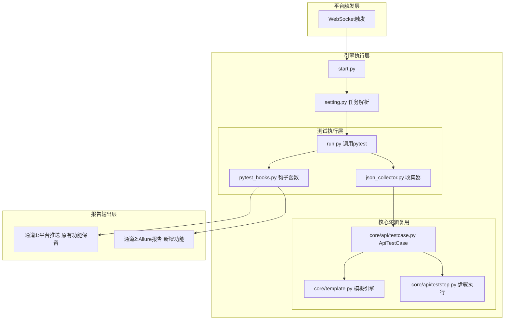
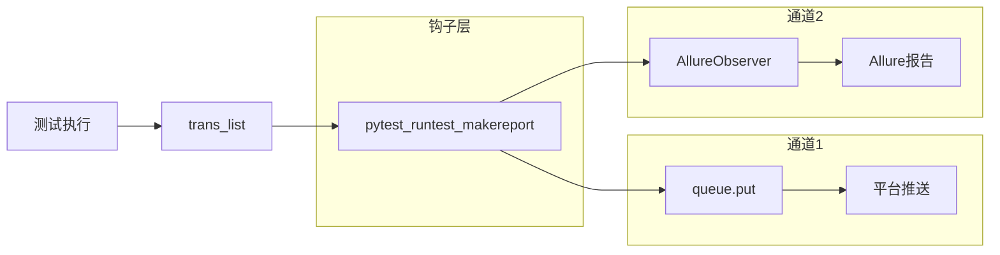

# 测试引擎Pytest+Allure重构技术方案

## 一、背景与需求分析

### 1.1 项目背景

流马自动化测试平台（TestEngin）是一款分布式执行引擎，当前采用Unittest框架作为API/Web/App测试执行核心。随着测试需求的发展和平台化建设的深入，现有Unittest框架在扩展性、插件生态、报告能力等方面存在一定局限性。

### 1.2 需求分析

| 需求项 | 说明 |
|--------|------|
| **核心目标** | 将API测试执行框架从Unittest迁移至Pytest |
| **附加目标1** | 集成Allure报告作为补充报告能力 |
| **附加目标2** | 保留原有平台结果推送功能 |
| **附加目标3** | 便于后续扩展负载均衡和插件生态 |
| **约束条件** | 仅重构API模块，Web/App保持不变 |
| **质量目标** | MVP最小可行方案，最小改动原则 |

### 1.3 痛点与挑战

| 痛点 | 说明 |
|------|------|
| **扩展性差** | Unittest缺乏插件生态，难以扩展分布式执行 |
| **报告能力弱** | 依赖自定义Result类，报告格式不标准 |
| **收集机制局限** | 动态创建测试类方式不够灵活 |
| **生态隔离** | 与主流测试框架生态脱节 |

---

## 二、技术方案设计

### 2.1 整体架构设计



### 2.2 核心设计原则

| 原则 | 说明 |
|------|------|
| **最小改动原则** | 核心执行逻辑（core/api/）完全不动 |
| **解耦原则** | Allure报告采用旁路观察者模式，不侵入测试代码 |
| **复用原则** | 复用现有ApiTestCase.execute()执行逻辑 |
| **渐进原则** | MVP优先，Web/App保持现状 |

### 2.3 模块划分

| 模块 | 状态 | 说明 |
|------|------|------|
| `core/api/testcase.py` | **不变** | ApiTestCase核心执行逻辑 |
| `core/api/teststep.py` | **不变** | 步骤执行器 |
| `core/api/collector.py` | **不变** | 数据收集器 |
| `core/template.py` | **不变** | 模板渲染引擎 |
| `app/case.py` | **可能微调** | LMCase基类 |
| `app/result.py` | **保留** | Web/App使用，API可能用不上 |
| `app/run.py` | **小改** | 改为调用pytest API |
| `app/json_collector.py` | **新增** | 自定义JSON收集器 |
| `app/pytest_hooks.py` | **新增** | pytest钩子函数 |

---

## 三、核心实现方案

### 3.1 JSON文件收集器（pytest_collect_file）

#### 3.1.1 设计思路

利用pytest的`pytest_collect_file`钩子函数，让pytest能够识别并收集平台下发的JSON测试文件，将其转换为可执行的测试用例。

#### 3.1.2 类设计

```python
# app/json_collector.py

# 核心类：
# 1. JSONFile - 继承pytest.Collector，处理JSON文件收集
# 2. JSONCaseItem - 继承pytest.Function，代表单个测试用例
# 3. PytestTestCase - 适配器类，桥接pytest和现有ApiTestCase
```

#### 3.1.3 工作流程

```
pytest扫描目录
    ↓
pytest_collect_file() 钩子被调用
    ↓
检测.json文件 → 返回JSONFile收集器
    ↓
JSONFile.collect() 解析JSON
    ↓
为每个用例生成JSONCaseItem
    ↓
runtest()执行时调用ApiTestCase
```

### 3.2 旁路观察者模式（Allure报告）

#### 3.2.1 设计思路

采用旁路观察者模式，测试执行只负责生成`trans_list`数据，报告生成作为独立"观察者"，不侵入测试执行逻辑。

#### 3.2.2 实现方式

| 阶段 | 处理方式 |
|------|---------|
| **测试执行时** | 正常执行，填充trans_list（与现有逻辑一致） |
| **测试结束后** | pytest_runtest_makereport钩子观察trans_list |
| **报告生成** | 遍历trans_list，生成Allure step和附件 |

#### 3.2.3 类设计

```python
# app/pytest_hooks.py

# 核心类：
# 1. AllureObserver - 观察者类，负责把trans_list转换为Allure报告
# 2. pytest_runtest_makereport - 钩子函数，双通道输出
```

### 3.3 双通道报告机制



---

## 四、文件改动清单

### 4.1 新增文件

| 文件路径 | 说明 |
|---------|------|
| `app/json_collector.py` | 自定义JSON测试用例收集器 |
| `app/pytest_hooks.py` | pytest钩子函数（平台推送+Allure） |
| `tests/__init__.py` | 测试包标识 |
| `tests/conftest.py` | pytest配置和共享fixtures |
| `tests/test_collector/__init__.py` | 收集器测试包 |
| `tests/test_collector/test_json_file.py` | JSONFile类单元测试 |
| `tests/test_collector/test_case_item.py` | JSONCaseItem类单元测试 |
| `tests/test_hooks/__init__.py` | 钩子测试包 |
| `tests/test_hooks/test_observer.py` | AllureObserver类单元测试 |
| `tests/fixtures/__init__.py` | 测试数据包 |
| `tests/fixtures/sample_case.json` | 示例测试数据 |

### 4.2 改动文件

| 文件路径 | 改动说明 |
|---------|---------|
| `app/run.py` | 改为调用pytest.main()执行测试 |
| `requirements.txt` | 添加pytest、allure-pytest依赖 |

### 4.3 保留文件

| 文件路径 | 说明 |
|---------|------|
| `core/api/testcase.py` | 完全不变，复用执行逻辑 |
| `core/api/teststep.py` | 完全不变 |
| `core/api/collector.py` | 完全不变 |
| `core/template.py` | 完全不变 |
| `app/case.py` | Web/App仍使用 |
| `app/result.py` | Web/App仍使用 |
| `core/web/` | 完全不变 |
| `core/app/` | 完全不变 |

---

## 五、单元测试设计

### 5.1 测试分层

| 层级 | 隔离程度 | Mock策略 |
|------|---------|---------|
| 单元测试 | 完全隔离 | 全部Mock外部依赖 |
| 集成测试 | 部分隔离 | Mock HTTP服务 |
| E2E测试 | 不隔离 | 跳过，CI/CD时运行 |

### 5.2 单元测试覆盖

| 被测类 | 测试内容 |
|--------|---------|
| JSONFile | collect()返回测试用例项、JSON解析正确性 |
| JSONCaseItem | runtest()执行流程、trans_list填充 |
| AllureObserver | generate_report()生成步骤、附件格式化 |
| pytest钩子 | 钩子函数调用时机、双通道输出验证 |

### 5.3 测试数据设计

使用手动构造的测试数据（fixtures），与真实业务完全解耦：
- `sample_case_data` - 基础用例数据
- `sample_api_list` - API列表数据
- `sample_trans_list` - 事务列表数据

---

## 六、实施计划

### 6.1 MVP阶段（第1轮）

| 序号 | 任务 | 预计改动量 |
|------|------|-----------|
| 1 | 添加pytest、allure-pytest依赖 | 1行 |
| 2 | 实现json_collector.py收集器 | 新增~150行 |
| 3 | 实现pytest_hooks.py钩子函数 | 新增~100行 |
| 4 | 改动run.py调用pytest | 约20行 |
| 5 | 编写单元测试 | 新增~200行 |

### 6.2 验证阶段

- [ ] 本地pytest能正常执行JSON测试用例
- [ ] trans_list正确传递给平台推送通道
- [ ] Allure报告能正确生成
- [ ] Web/App模块执行不受影响

---

## 七、风险与应对

| 风险 | 影响 | 应对措施 |
|------|------|---------|
| pytest API调用方式不熟悉 | 可能无法正确执行 | 先行编写Demo验证 |
| trans_list数据格式兼容 | Allure报告可能不完整 | 适配器类做兼容处理 |
| 现有功能回归 | 破坏原有功能 | 保留原有执行路径做对照 |
| Web/App执行受影响 | 其他测试类型不可用 | 区分case_type执行不同路径 |

---

## 八、后续扩展方向

### 8.1 负载均衡

Pytest天然支持pytest-xdist插件，可实现分布式并行执行：

```bash
pytest -n auto --dist loadscope
```

### 8.2 插件扩展

| 插件 | 用途 |
|------|------|
| pytest-xdist | 分布式并行执行 |
| pytest-rerunfailures | 失败重试 |
| pytest-html | HTML报告 |
| pytest-mark | 测试标记和分类 |

---

## 九、总结

本方案以最小改动原则为核心，通过：

1. **自定义收集器**（pytest_collect_file）实现JSON文件识别
2. **复用现有核心**（ApiTestCase）保持执行逻辑不变
3. **旁路观察者**（AllureObserver）实现报告解耦
4. **双通道输出**保留平台推送，新增Allure报告

实现从Unittest到Pytest的平滑迁移，同时为后续扩展负载均衡和插件生态奠定基础。

---

## 附录：检查清单

### 编码前检查

- [ ] 理解现有引擎执行流程
- [ ] 确认pytest_collect_file使用方式
- [ ] 确认旁路观察者实现方式
- [ ] 确认复用ApiTestCase的接口

### 编码中检查

- [ ] 核心执行逻辑（core/api/）未修改
- [ ] 单元测试覆盖核心类
- [ ] 注释率≥30%

### 完成后检查

- [ ] API测试能正常执行
- [ ] 平台推送功能正常
- [ ] Allure报告正常生成
- [ ] Web/App测试不受影响
