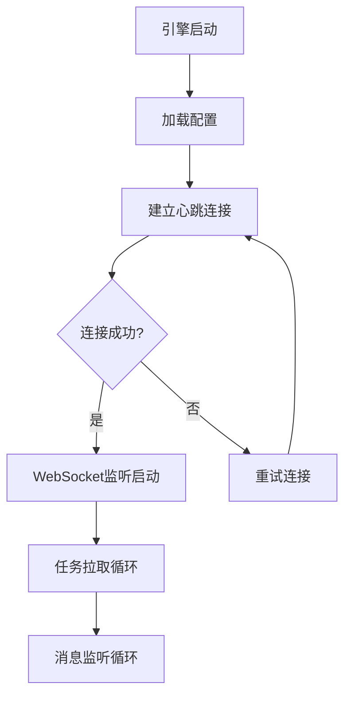
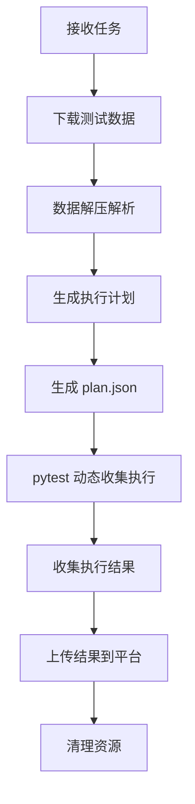
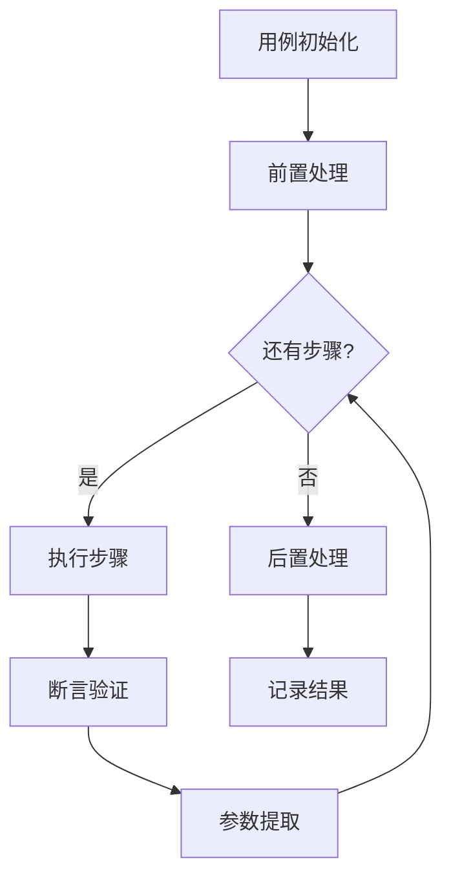

# 流马测试平台 - 测试执行引擎（TestEngin）

## 一、项目概述

### 1.1 项目定位

测试执行引擎（TestEngin）是流马自动化测试平台的分布式执行组件，负责接收平台下发的测试任务，解析测试数据，执行 API/WEB/APP 测试，并回传执行结果。

当前版本在 **API 执行链路** 上引入了基于 **pytest 动态收集 Item** 的执行方式，用于替换原有的 unittest TestSuite 驱动，并保持平台调度/回传协议不变。

### 1.2 技术栈

| 技术 | 说明 |
|------|------|
| Python 3.8+ | 核心语言 |
| Pytest | API 执行计划与动态收集（引擎侧执行框架） |
| Requests | HTTP请求处理 |
| Selenium | Web自动化 |
| uiautomator2 | Android自动化 |
| Facebook-wda | iOS自动化 |
| WebSocket | 与平台实时通信 |

### 1.3 核心特性

- **分布式架构**：引擎可注册到任意机器，突破资源限制
- **多测试类型**：支持 API、WebUI、AppUI 三种测试
- **实时通信**：WebSocket 长连接，任务实时推送
- **并发执行**：多进程 + 多线程，支持高并发
- **结果回传**：实时上传执行结果和截图日志

---

## 二、项目结构

```
TestEngin/
├── app/                          # 应用入口
│   ├── start.py                  # 启动入口
│   ├── run.py                   # 执行入口
│   ├── ws.py                    # WebSocket通信
│   ├── config.py                 # 配置加载
│   └── log.py                   # 日志配置
├── core/                         # 核心执行引擎
│   ├── api/                     # API测试执行器
│   │   ├── collector.py         # 用例收集
│   │   ├── testcase.py          # 用例执行
│   │   └── teststep.py          # 步骤执行
│   ├── web/                     # Web测试执行器
│   │   ├── driver/              # 浏览器驱动
│   │   ├── collector.py
│   │   ├── testcase.py
│   │   └── teststep.py
│   ├── app/                    # App测试执行器
│   │   ├── device/             # 设备操作
│   │   ├── collector.py
│   │   ├── testcase.py
│   │   └── teststep.py
│   ├── assertion.py             # 断言处理
│   └── template.py             # 模板处理
├── tools/                       # 工具模块
│   ├── funclib/                # 函数库
│   │   ├── provider/           # 函数提供者
│   │   └── load_faker.py      # Faker数据生成
│   └── utils/                  # 工具类
│       ├── sql.py              # 数据库操作
│       └── utils.py            # 通用工具
├── config/                      # 配置文件
│   └── config.ini              # 引擎配置
├── browser/                     # 浏览器驱动
│   └── readme.md               # 驱动说明
└── assets/                      # 说明文档
    └── engin相关说明(按需了解即可)/
```

---

## 三、核心模块说明

### 3.1 应用入口 (app/)

| 文件 | 职责 |
|------|------|
| start.py | 引擎启动入口，初始化配置和连接 |
| run.py | 测试执行入口，管理任务执行流程 |
| ws.py | WebSocket 通信，与平台实时交互 |
| config.py | 配置文件加载和解析 |
| log.py | 日志配置和输出管理 |

### 3.2 核心执行引擎 (core/)

#### API 测试执行器 (core/api/)
- **collector.py**：用例收集器，解析平台下发的测试数据
- **testcase.py**：用例执行器，管理单个用例的执行流程
- **teststep.py**：步骤执行器，执行具体的接口请求

#### Web 测试执行器 (core/web/)
- **driver/**：Selenium 封装，包含浏览器操作、元素定位、断言等
- **collector.py**：Web 用例收集
- **testcase.py**：Web 用例执行
- **teststep.py**：Web 步骤执行

#### App 测试执行器 (core/app/)
- **device/**：设备操作封装（Android uiautomator2 / iOS wda）
- **collector.py**：App 用例收集
- **testcase.py**：App 用例执行
- **teststep.py**：App 步骤执行

### 3.3 工具模块 (tools/)

| 模块 | 职责 |
|------|------|
| funclib/provider | 内置函数提供者 |
| load_faker | Faker 数据生成封装 |
| utils/sql | 数据库操作工具 |
| utils/utils | 通用工具函数 |

---

## 四、核心流程设计

### 4.1 引擎启动流程



### 4.2 任务执行流程



### 4.3 用例执行流程



---

## 五、数据格式说明

### 5.1 任务数据 (case_data.json)

引擎从平台接收的测试数据格式：

```json
{
    "taskId": "任务ID",
    "testType": "api/web/app",
    "testClass": "测试类名",
    "cases": [
        {
            "caseId": "用例ID",
            "name": "用例名称",
            "steps": [
                {
                    "stepId": "步骤ID",
                    "action": "请求方法",
                    "target": "请求URL",
                    "value": "请求参数",
                    "assertions": []
                }
            ]
        }
    ]
}
```

### 5.2 结果数据 (case_result.json)

引擎回传给平台的结果格式：

```json
{
    "taskId": "任务ID",
    "results": [
        {
            "caseId": "用例ID",
            "status": "pass/fail/error",
            "startTime": "开始时间",
            "endTime": "结束时间",
            "duration": 1000,
            "transList": [
                {
                    "id": "步骤ID",
                    "status": 1,
                    "log": "执行日志",
                    "screenShotList": []
                }
            ]
        }
    ]
}
```

---

## 六、配置说明

### 6.1 config.ini 配置项

```ini
[Platform]
url = http://localhost:8080  # 平台后端地址
engine-code = your_code      # 引擎编码
engine-secret = your_secret  # 引擎密钥

[Engine]
max-run = 3                  # 最大并发任务数

[WebDriver]
path = chromedriver          # 驱动路径
options = --no-sandbox       # 启动选项
```

### 6.2 环境要求

- Python 3.8+
- Chrome 浏览器 + ChromeDriver
- MySQL/Redis（平台依赖）

---

## 七、开发指南

### 7.0 pytest 执行改造说明（API）

#### 设计目标
- 平台侧 **调度与回传协议不变**：引擎仍通过队列产出 `case_info`，由 Reporter 统一上传
- API 执行从 “unittest suite” 调整为 “plan.json + pytest 动态收集 Item”
- Allure **完全旁路**：仅供开发人员本地查看，不影响平台回传

#### 关键实现点
- `app/plan_builder.py`：将任务解析产物写入 `data/{taskId}/{taskId}.run{n}.plan.json`
- `app/pytest_api_plan_plugin.py`：pytest 收集 `.plan.json` 并执行每条 case，实时 `queue.put(case_info)`
- `app/api_runtime.py`：提供 API-only Runtime，解耦 unittest._outcome 等内部结构依赖
- `app/allure_replay.py`：旁路回放 transactionList 为 Allure step/附件（可开关，失败静默）

#### Allure（开发旁路）
- 默认关闭；开启方式：设置环境变量 `TESTENGIN_ALLURE=1`
- 开启后会在任务目录下生成 `data/{taskId}/allure-results/run{n}`（如果本机有对应 pytest Allure 插件）

#### 测试运行
```bash
# 单元/集成测试（不依赖平台/网络/真实数据库）
python -m pytest
```

### 7.1 添加自定义函数

```python
# tools/funclib/provider/provider.py
def custom_function(param):
    """
    自定义函数说明
    @param {string} param - 参数说明
    @returns {string} 返回值说明
    """
    # 函数逻辑
    return result
```

### 7.2 添加新断言类型

```python
# core/assertion.py
def assert_custom(actual, expected):
    """
    自定义断言逻辑
    @param actual: 实际值
    @param expected: 期望值
    @returns: 断言结果
    """
    return actual == expected
```

---

## 八、相关文档

- [引擎业务逻辑设计](./assets/engin相关说明(按需了解即可)/业务逻辑设计.md)
- [功能模块设计](./assets/engin相关说明(按需了解即可)/功能模块设计.md)
- [数据格式说明](./assets/engin相关说明(按需了解即可)/补充（数据详情）/json数据设计及示例.md)

---

## 九、部署与启动

### 9.1 本地启动

```bash
# 1. 安装依赖
pip3 install -r requirements.txt

# 2. 配置引擎参数
# 编辑 config/config.ini，填入 engine-code 和 engine-secret

# 3. 启动引擎
python3 startup.py
```

### 9.2 Docker 部署

详见官方部署文档：http://www.liumatest.cn/deployDoc

---

## 十、联系与支持

- 演示平台：http://demo-ee.liumatest.cn
- 官网地址：http://www.liumatest.cn
- 社区地址：http://community.liumatest.cn
- B站课堂：https://www.bilibili.com/cheese/play/ss7009
