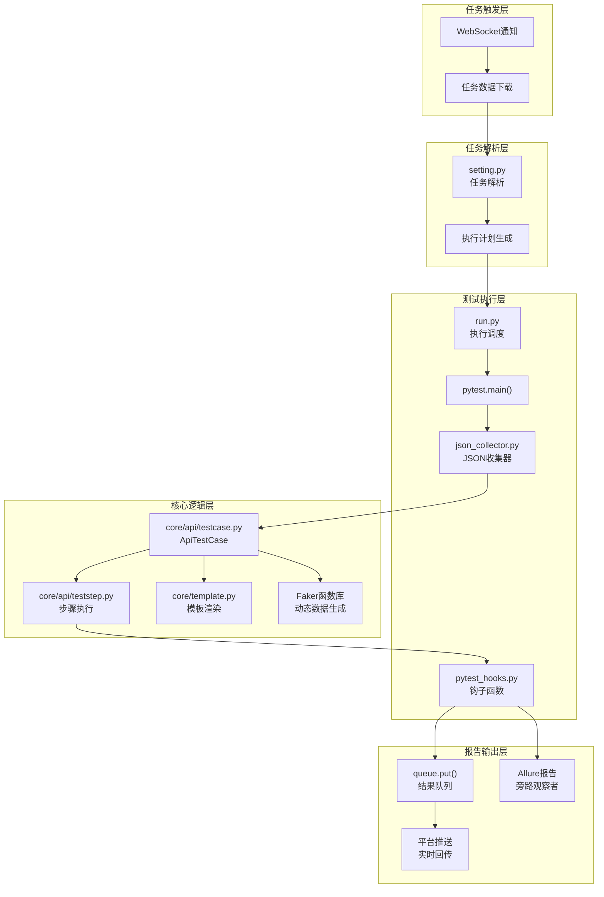
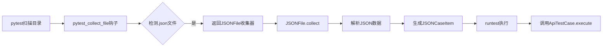
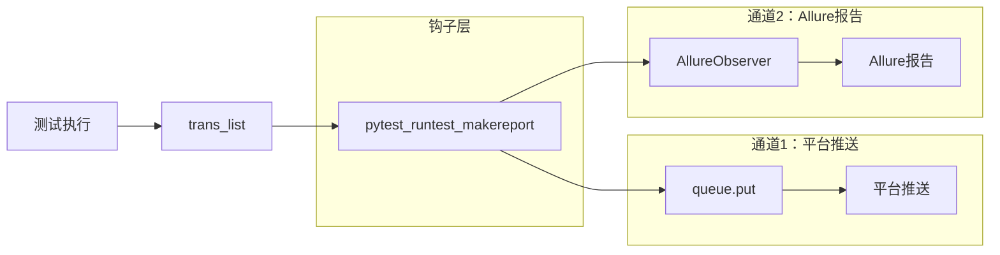
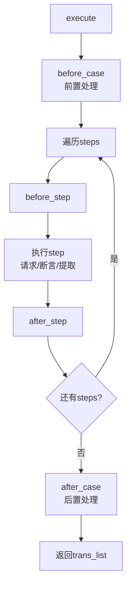
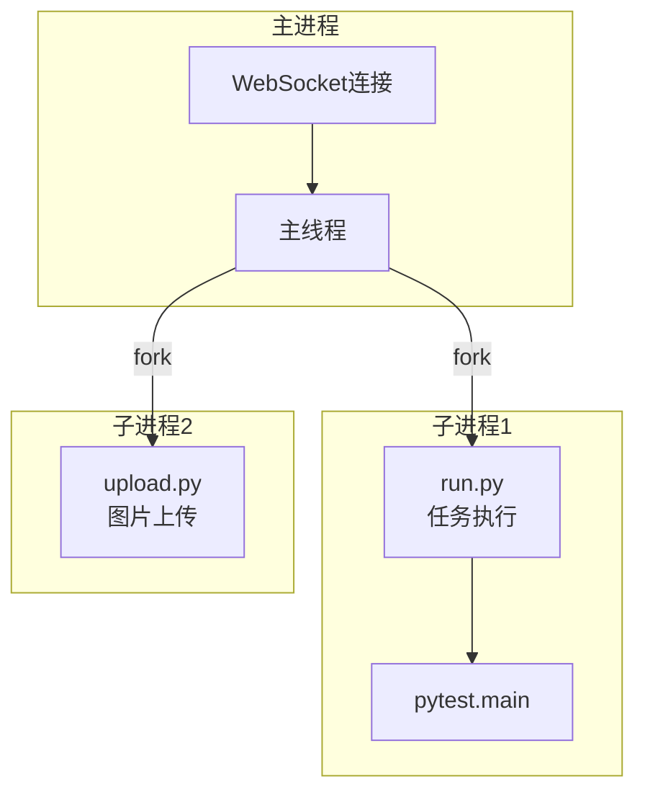
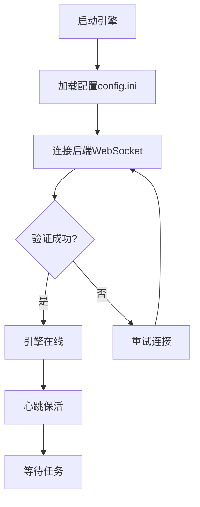
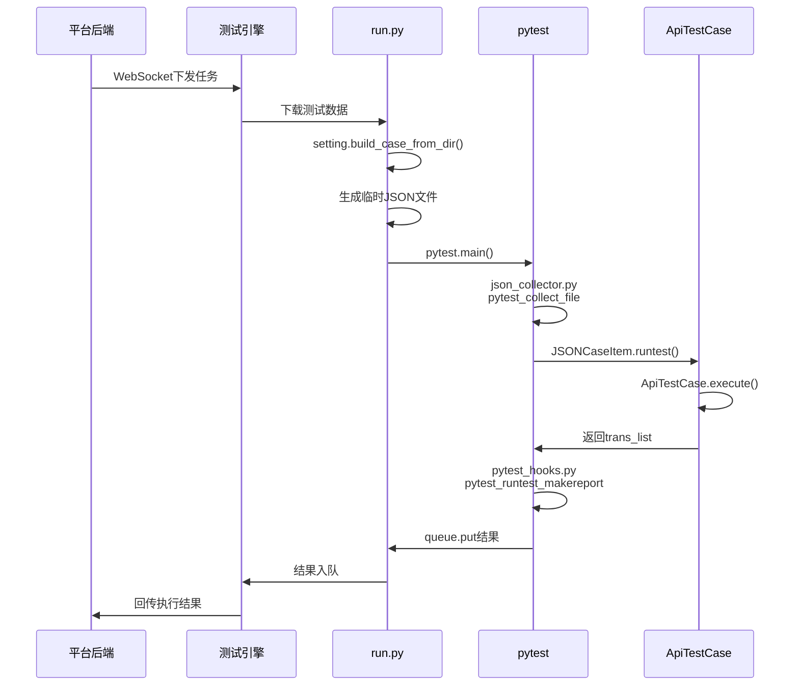
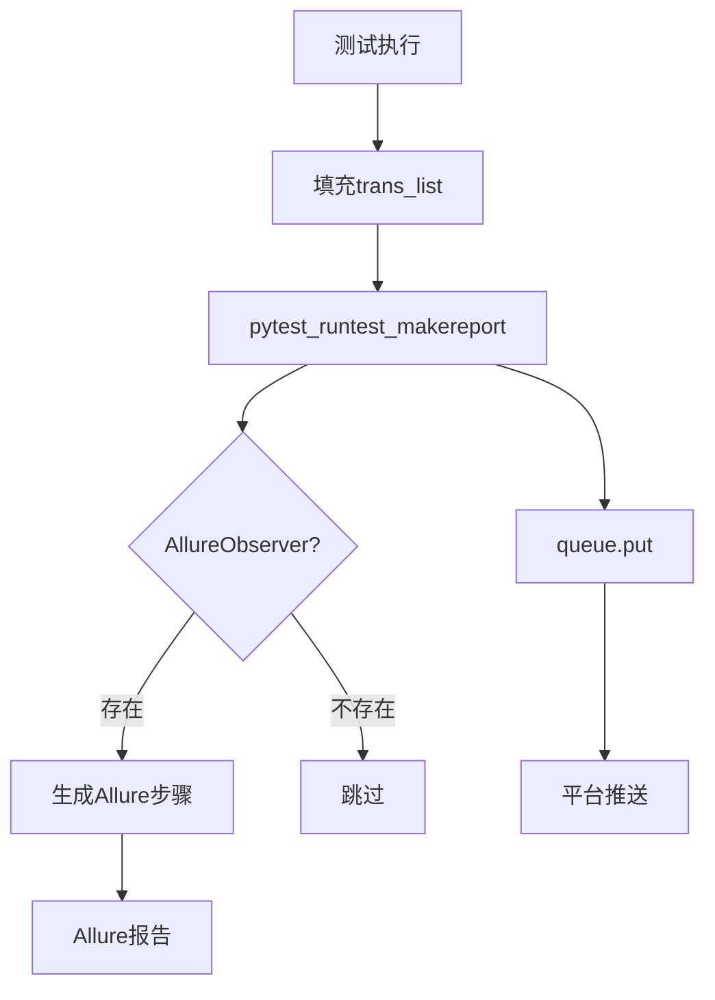

# 测试执行引擎

分布式接口测试执行引擎，基于 Python + Pytest 重构，支持自定义JSON收集器、双通道报告输出、多进程并发执行。

## 一、项目概述

### 1.1 定位

测试执行引擎是AI智能接口测试平台的分布式执行组件，负责接收平台下发的测试任务，解析测试数据，执行接口测试，并回传执行结果。

### 1.2 核心特性

| 特性 | 说明 |
|------|------|
| **Pytest重构** | 基于Pytest框架重构，支持插件生态扩展 |
| **自定义收集器** | 通过`pytest_collect_file`钩子识别JSON测试文件 |
| **双通道报告** | 平台推送(核心) + Allure报告(可选)，0业务侵入 |
| **多进程架构** | 任务执行、结果上报、图片上传分离，支持高并发 |
| **实时通信** | WebSocket长连接，任务实时推送与结果回传 |
| **核心复用** | 复用原有`ApiTestCase.execute()`执行逻辑 |

### 1.3 技术架构



### 1.4 技术栈

| 技术 | 说明 |
|------|------|
| Python 3.8+ | 核心语言 |
| Pytest | API测试框架 |
| Requests | HTTP请求处理 |
| WebSocket | 与平台实时通信 |
| Allure | 报告生成（可选） |
| Faker | 动态测试数据生成 |
| Multiprocessing | 多进程并发执行 |

---

## 二、项目结构

```
TestEngin/
├── app/                          # 应用入口
│   ├── start.py                  # 引擎启动入口
│   ├── run.py                    # 执行入口（Pytest模式）
│   ├── json_collector.py         # Pytest JSON收集器
│   ├── pytest_hooks.py           # Pytest钩子函数
│   ├── ws.py                     # WebSocket通信
│   ├── setting.py                # 任务解析
│   ├── case.py                   # 用例基类
│   ├── result.py                 # 结果处理
│   ├── report.py                 # 报告生成
│   ├── api.py                    # 平台API客户端
│   ├── upload.py                 # 图片上传
│   ├── config.py                 # 配置加载
│   └── log.py                    # 日志配置
├── core/                         # 核心执行引擎
│   ├── api/                      # API测试执行器
│   │   ├── collector.py          # 用例收集
│   │   ├── testcase.py           # 用例执行（复用）
│   │   └── teststep.py           # 步骤执行
│   ├── assertion.py              # 断言处理
│   └── template.py               # 模板处理
├── tools/                        # 工具模块
│   ├── funclib/                  # 函数库
│   │   ├── provider/             # 函数提供者
│   │   └── load_faker.py         # Faker数据生成
│   └── utils/                    # 工具类
│       ├── sql.py                # 数据库操作
│       └── utils.py              # 通用工具
├── config/                       # 配置文件
│   └── config.ini                # 引擎配置
└── assets/                       # 说明文档
```

---

## 三、核心模块说明

### 3.1 应用入口 (app/)

| 文件 | 职责 |
|------|------|
| start.py | 引擎启动入口，初始化配置、WebSocket连接、心跳保活 |
| run.py | 测试执行入口，管理任务执行流程（Pytest模式） |
| json_collector.py | Pytest自定义JSON收集器，识别平台JSON测试文件 |
| pytest_hooks.py | Pytest钩子函数，双通道报告输出 |
| ws.py | WebSocket通信，与平台实时交互 |
| setting.py | 任务解析，生成执行计划 |

### 3.2 JSON收集器 (json_collector.py)

利用pytest的`pytest_collect_file`钩子函数，让pytest能够识别并收集平台下发的JSON测试文件。

**核心类：**

| 类名 | 继承 | 职责 |
|------|------|------|
| `JSONFile` | `pytest.Collector` | 处理JSON文件收集，解析JSON数据 |
| `JSONCaseItem` | `pytest.Function` | 代表单个测试用例，执行测试 |
| `PytestTestCase` | `object` | 适配器类，桥接pytest和现有ApiTestCase |

**工作流程：**



### 3.3 Pytest钩子 (pytest_hooks.py)

实现旁路观察者模式，测试执行只负责生成`trans_list`数据，报告生成作为独立"观察者"。

**核心函数：**

| 钩子 | 职责 |
|------|------|
| `pytest_configure` | 配置pytest，初始化AllureObserver（可选） |
| `pytest_runtest_makereport` | 测试结束后收集结果，双通道输出 |
| `pytest_sessionfinish` | 会话结束，生成Allure报告（可选） |

**双通道报告机制：**



**数据传递机制：**
- 通过`item.stash`存储测试数据（case_data, case_id, queue）
- 通过`item.stash`存储执行结果（trans_list）
- 钩子函数从stash读取数据，实现解耦

### 3.4 任务执行 (run.py)

| 方法 | 职责 |
|------|------|
| `run_test()` | 主执行入口，调用pytest |
| `run_api_test()` | API测试执行，使用pytest |
| `run()` | 多进程执行入口 |

**执行流程：**

```python
# 1. 解析任务
setting = Setting()
plan_tuple = setting.build_case_from_dir()

# 2. 生成临时JSON文件
case_data.json  # 用例数据
env_data.json   # 环境数据

# 3. 调用pytest
pytest.main([
    temp_dir,
    "-v",
    "--capture=no",
    "--alluredir=htmlcov/allure-results"  # 可选
])
```

### 3.5 核心执行逻辑 (core/api/)

**复用原有核心逻辑，完全不变：**

| 文件 | 职责 |
|------|------|
| testcase.py | `ApiTestCase`核心执行逻辑，管理单个用例的执行流程 |
| teststep.py | 步骤执行器，执行具体的接口请求 |
| collector.py | 数据收集器，解析平台下发的测试数据 |

**ApiTestCase执行流程：**



### 3.6 WebSocket通信 (ws.py)

| 方法 | 职责 |
|------|------|
| `connect()` | 建立WebSocket连接 |
| `on_message()` | 处理平台消息 |
| `heart_beat()` | 心跳保活 |
| `run_task()` | 执行任务 |

**多进程架构：**



---

## 四、核心流程

### 4.1 引擎启动流程



### 4.2 测试执行流程



### 4.3 双通道报告流程



### 4.4 模板渲染与函数调用

```mermaid
flowchart LR
    A[模板字符串] --> B{检测变量}
    B -->|${var}| C[变量替换]
    B -->|$func()| D[函数调用]
    B -->|{{expr}}| E[表达式求值]
    
    D --> F[Faker函数库]
    D --> G[自定义函数]
    
    C --> H[渲染结果]
    F --> H
    G --> H
    E --> H
```

---

## 五、配置说明

### 5.1 config.ini

```ini
[Platform]
url = http://localhost:8080      # 平台后端地址
engine-code = your_code          # 引擎编码
engine-secret = your_secret      # 引擎密钥

[Engine]
max-run = 3                      # 最大并发任务数

[Log]
level = INFO                     # 日志级别
path = ./logs                    # 日志路径
```

### 5.2 环境变量

| 变量 | 说明 |
|------|------|
| `ALLURE_ENABLED` | 启用Allure报告（true/false） |
| `PYTEST_WORKERS` | pytest并行工作数 |

---

## 六、启动服务

```bash
cd TestEngin

# 安装依赖
pip3 install -r requirements.txt

# 配置引擎参数
# 编辑 config/config.ini，填入 engine-code 和 engine-secret

# 启动引擎
python3 startup.py
```

---

## 七、核心亮点

### 7.1 Pytest重构

- **自定义收集器**：通过`pytest_collect_file`钩子识别平台JSON测试文件
- **复用核心逻辑**：完全复用原有`ApiTestCase.execute()`执行逻辑
- **插件生态**：支持pytest-xdist、pytest-rerunfailures等插件

### 7.2 双通道报告

- **旁路观察者模式**：测试执行与报告生成解耦
- **平台推送（核心）**：通过queue实时推送结果
- **Allure报告（可选）**：通过stash传递数据，0业务侵入

### 7.3 多进程架构

- **任务执行**：独立进程执行测试
- **结果上报**：独立进程上报结果
- **图片上传**：独立进程处理图片
- **心跳保活**：WebSocket长连接维持

### 7.4 模板引擎

- **动态变量**：支持`${var}`语法
- **函数调用**：支持`$func()`语法，内置Faker
- **表达式**：支持`{{expr}}`语法
- **闭包封装**：Faker函数灵活调用

---

## 八、数据格式

### 8.1 任务数据 (case_data.json)

```json
{
    "taskId": "任务ID",
    "testType": "api",
    "testClass": "测试类名",
    "cases": [
        {
            "caseId": "用例ID",
            "name": "用例名称",
            "steps": [
                {
                    "stepId": "步骤ID",
                    "action": "GET/POST/PUT/DELETE",
                    "target": "请求URL",
                    "value": "请求参数",
                    "assertions": [
                        {
                            "type": "equals",
                            "target": "$.code",
                            "expect": 200
                        }
                    ],
                    "extracts": [
                        {
                            "name": "token",
                            "type": "jsonpath",
                            "expression": "$.data.token"
                        }
                    ]
                }
            ]
        }
    ]
}
```

### 8.2 结果数据 (trans_list)

```json
[
    {
        "id": "步骤ID",
        "status": 1,
        "log": "执行日志",
        "screenShotList": [],
        "startTime": "开始时间",
        "endTime": "结束时间",
        "duration": 1000
    }
]
```

---

## 九、二开指南

### 9.1 添加自定义函数

```python
# tools/funclib/provider/provider.py

def custom_function(param):
    """
    自定义函数说明
    @param {string} param - 参数说明
    @returns {string} 返回值说明
    """
    # 函数逻辑
    return result
```

### 9.2 添加新断言类型

```python
# core/assertion.py

def assert_custom(actual, expected):
    """
    自定义断言逻辑
    @param actual: 实际值
    @param expected: 期望值
    @returns: 断言结果
    """
    return actual == expected
```

### 9.3 扩展Pytest钩子

```python
# app/pytest_hooks.py

def pytest_collection_modifyitems(config, items):
    """自定义测试收集逻辑"""
    pass

def pytest_runtest_setup(item):
    """测试前置处理"""
    pass
```

---

## 十、Allure报告（可选）

### 10.1 开启方式

```bash
# 环境变量方式
set ALLURE_ENABLED=true
python3 startup.py

# 或者在pytest.main参数中指定
pytest tests/ --alluredir=htmlcov/allure-results
```

### 10.2 查看报告

```bash
# 启动Allure服务
allure serve htmlcov/allure-results

# 或者生成静态报告
allure generate htmlcov/allure-results -o allure-report
allure open allure-report
```

---

## 十一、依赖说明

核心依赖：
- `pytest` - 测试框架
- `requests` - HTTP请求
- `websocket-client` - WebSocket通信
- `allure-pytest` - Allure报告（可选）
- `faker` - 动态数据生成
- `jinja2` - 模板引擎
- `jsonpath-ng` - JSONPath解析
