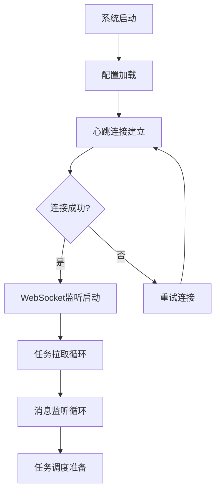
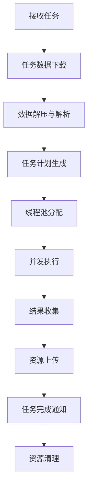
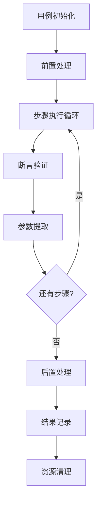

# auto-engine 业务逻辑设计

## 概述

auto-engine 是一个分布式自动化测试执行引擎，采用多层架构设计，支持 API、WEB、APP 三种测试类型的统一执行。本文档详细描述了系统的核心业务逻辑、关键业务规则和异常处理机制。

## 核心业务流程

### 1. 引擎启动流程

引擎启动是整个系统运行的基础，包含系统初始化、平台连接、任务监听等关键步骤。



**详细步骤说明：**

1. **配置加载阶段**
   - 读取 `config.ini` 配置文件
   - 初始化平台连接参数（URL、Token、引擎编码等）
   - 验证必要配置项的完整性
   - 设置日志记录器和输出级别

2. **心跳连接建立**
   - 向平台发送心跳请求，验证引擎状态
   - 获取平台分配的任务队列信息
   - 建立 WebSocket 长连接用于实时通信
   - 注册引擎状态监听器

3. **任务监听启动**
   - 启动任务拉取线程，定期从平台获取待执行任务
   - 启动 WebSocket 消息监听，接收平台实时指令
   - 初始化任务队列和结果队列
   - 启动结果上传监控线程

### 2. 任务执行流程

任务执行是系统的核心业务流程，从接收任务到完成执行的完整生命周期管理。



**详细步骤说明：**

1. **任务接收与验证**
   - 从平台任务队列获取待执行任务
   - 验证任务格式和必要参数（taskId、taskType、downloadUrl 等）
   - 检查引擎当前负载，判断是否可以接收新任务
   - 将任务加入本地执行队列

2. **测试数据准备**
   - 根据 `downloadUrl` 下载测试数据包（ZIP 格式）
   - 解压数据包到 `data/{taskId}/` 目录
   - 解析测试集合和用例列表
   - 验证测试数据的完整性和格式正确性

3. **执行计划生成**
   - 分析测试集合的依赖关系
   - 根据 `maxThread` 参数确定并发度
   - 为每个测试集合分配执行线程
   - 生成用例执行顺序和优先级

4. **并发执行控制**
   - 创建线程池，按集合分组执行
   - 为每个线程分配独立的执行上下文
   - 监控线程执行状态和资源使用情况
   - 处理线程间的数据共享和同步

5. **结果收集与上传**
   - 实时收集各线程的执行结果
   - 将结果数据格式化为平台要求的格式
   - 批量上传测试结果到平台
   - 上传执行过程中生成的截图和日志文件

### 3. 用例执行流程

用例执行是测试的最小执行单元，包含完整的测试生命周期管理。



**详细步骤说明：**

1. **用例初始化**
   - 创建测试用例实例（继承自 `Case`）
   - 设置用例基本属性（task_id、test_type、test_class 等）
   - 初始化执行上下文（context）和参数变量
   - 根据测试类型初始化相应的驱动对象（driver/session）

2. **前置处理**
   - 执行用例级别的 setUp 方法
   - 加载测试数据和配置参数
   - 建立测试环境连接（如浏览器启动、API 会话创建）
   - 执行环境准备脚本

3. **步骤执行循环**
   - 按顺序执行测试步骤（TestStep）
   - 每个步骤作为一个事务（Transaction）记录
   - 支持条件执行和循环执行
   - 记录步骤执行时间和状态

4. **断言验证**
   - 执行断言检查，验证实际结果与期望结果
   - 支持多种断言类型（相等、包含、大于、正则匹配等）
   - 自动进行数据类型转换和格式化
   - 记录断言结果和失败原因

5. **参数提取**
   - 从响应结果中提取关联参数
   - 支持 JSONPath、正则表达式、XPath 等提取方式
   - 将提取的参数存储到上下文中
   - 为后续步骤提供参数引用

6. **后置处理**
   - 执行用例级别的 tearDown 方法
   - 清理测试环境和临时数据
   - 关闭驱动连接和会话
   - 生成执行报告和截图

## 关键业务规则

### 1. 任务调度规则

**并发控制规则：**
- 单个引擎最大并发任务数由配置文件 `max-run` 参数控制
- 每个任务的最大并发线程数由任务参数 `maxThread` 控制
- 测试集合内的用例按顺序执行，集合间可并发执行
- 当系统资源不足时，新任务将进入等待队列

**任务优先级规则：**
- 调试任务（debug）优先级高于普通任务（normal）
- 任务按接收时间顺序执行，先进先出（FIFO）
- 长时间运行的任务不会阻塞后续任务的启动
- 支持任务的强制停止和优雅停止

**资源分配规则：**
- 每个任务分配独立的数据目录和日志文件
- 浏览器驱动按线程分配，避免冲突
- 截图文件按任务 ID 分目录存储
- 任务完成后自动清理临时资源

### 2. 用例执行规则

**执行顺序规则：**
- 用例按照测试集合中定义的 `index` 顺序执行
- 同一集合内的用例串行执行，保证数据依赖关系
- 不同集合的用例可以并发执行
- 支持用例的条件跳过和强制停止

**数据共享规则：**
- 同一线程内的用例共享执行上下文（context）
- 参数变量在用例间传递，支持数据关联
- 会话对象（session）在 API 用例间复用
- 浏览器驱动（driver）在 WEB 用例间复用

**失败处理规则：**
- 用例执行失败不影响其他用例的执行
- 支持失败重试机制（reRun 参数控制）
- 断言失败记录详细的失败原因和截图
- 异常错误自动记录堆栈信息

### 3. 断言验证规则

**断言类型支持：**
- 基础断言：equal、not_equal、contains、not_contains
- 数值断言：greater、greater_equal、less、less_equal
- 字符串断言：startswith、endswith、regex_match
- 集合断言：in、not_in、length_equal、length_greater
- 类型断言：type_match、is_null、is_not_null

**数据类型转换：**
- 自动识别数据类型并进行合理转换
- 数值比较时自动转换为数值类型
- 字符串比较时统一转换为字符串类型
- 布尔值比较支持多种表示形式（true/false、1/0、yes/no）

**断言结果处理：**
- 断言成功继续执行后续步骤
- 断言失败记录失败信息但不中断用例执行
- 支持软断言（记录失败但继续执行）和硬断言（失败即停止）
- 断言结果影响用例的最终执行状态

### 4. 资源管理规则

**文件存储规则：**
- 测试数据按任务 ID 分目录存储：`data/{taskId}/`
- 截图文件按任务 ID 分目录存储：`image/{taskId}/`
- 日志文件按模块分类存储：`log/`
- 配置文件统一存储在：`config/`

**资源清理规则：**
- 任务完成后自动删除测试数据目录
- 截图文件上传成功后自动删除本地文件
- 日志文件定期轮转，保留最近 7 天的日志
- 浏览器驱动进程在任务结束后自动关闭

**上传管理规则：**
- 测试结果实时收集，批量上传（3 秒间隔）
- 截图文件定期扫描上传（5 秒间隔）
- 上传失败的文件自动重试（最多 3 次）
- 网络异常时暂停上传，恢复后继续

## 异常处理机制

### 1. 连接异常处理

**网络连接异常：**
- 心跳连接失败时自动重试，重试间隔递增（1s、2s、4s、8s...）
- WebSocket 连接断开时自动重连，保持消息监听
- HTTP 请求超时时自动重试，最多重试 3 次
- 平台服务不可用时进入离线模式，缓存本地结果

**处理策略：**
```python
def handle_connection_error(self, error):
    """
    处理连接异常
    @param error: 异常对象
    """
    self.retry_count += 1
    if self.retry_count <= self.max_retry:
        sleep_time = min(2 ** self.retry_count, 60)  # 指数退避，最大60秒
        time.sleep(sleep_time)
        self.reconnect()
    else:
        self.enter_offline_mode()
```

### 2. 任务执行异常处理

**任务级异常：**
- 任务数据下载失败时记录错误并跳过该任务
- 数据解析失败时尝试使用默认配置继续执行
- 线程创建失败时降低并发度重试
- 任务超时时强制终止并清理资源

**处理策略：**
```python
def handle_task_error(self, task_id, error):
    """
    处理任务执行异常
    @param task_id: 任务ID
    @param error: 异常对象
    """
    error_info = {
        "taskId": task_id,
        "errorType": type(error).__name__,
        "errorMessage": str(error),
        "timestamp": datetime.now().isoformat()
    }
    
    # 记录错误日志
    ErrorLogger(f"任务执行异常: {error_info}")
    
    # 清理任务资源
    self.cleanup_task_resources(task_id)
    
    # 通知平台任务失败
    self.report_task_failure(task_id, error_info)
```

### 3. 用例执行异常处理

**用例级异常：**
- 用例初始化失败时跳过该用例，继续执行其他用例
- 步骤执行异常时记录错误信息，根据配置决定是否继续
- 断言失败时记录失败原因，不中断后续步骤执行
- 驱动异常时尝试重新初始化驱动

**处理策略：**
```python
def handle_case_error(self, case_id, step_name, error):
    """
    处理用例执行异常
    @param case_id: 用例ID
    @param step_name: 步骤名称
    @param error: 异常对象
    """
    # 记录异常事务
    trans_info = {
        "id": f"{case_id}_{step_name}",
        "name": step_name,
        "status": 2,  # 错误状态
        "log": f"执行异常: {str(error)}",
        "during": 0
    }
    
    # 截图保存现场
    if hasattr(self, 'driver') and self.driver:
        screenshot_path = self.take_screenshot(f"error_{case_id}_{step_name}")
        trans_info["screenShotList"] = [screenshot_path]
    
    # 添加到事务列表
    self.trans_list.append(trans_info)
    
    # 根据异常类型决定是否继续执行
    if isinstance(error, (TimeoutException, NoSuchElementException)):
        return True  # 继续执行
    else:
        return False  # 停止执行
```

### 4. 数据异常处理

**数据格式异常：**
- JSON 解析失败时尝试修复格式或使用默认值
- 参数类型不匹配时自动进行类型转换
- 必要参数缺失时使用默认值或跳过该步骤
- 文件读取失败时记录错误并继续执行

**处理策略：**
```python
def handle_data_error(self, data_source, error):
    """
    处理数据异常
    @param data_source: 数据源标识
    @param error: 异常对象
    """
    if isinstance(error, json.JSONDecodeError):
        # JSON解析失败，尝试修复
        try:
            fixed_data = self.fix_json_format(data_source)
            return fixed_data
        except:
            # 修复失败，使用空对象
            DebugLogger(f"JSON修复失败，使用默认值: {data_source}")
            return {}
    
    elif isinstance(error, KeyError):
        # 键值缺失，使用默认值
        default_value = self.get_default_value(error.args[0])
        DebugLogger(f"参数缺失，使用默认值: {error.args[0]} = {default_value}")
        return default_value
    
    elif isinstance(error, TypeError):
        # 类型错误，尝试转换
        try:
            converted_value = self.convert_data_type(data_source)
            return converted_value
        except:
            DebugLogger(f"类型转换失败: {data_source}")
            return None
```

## 业务流程优化建议

### 1. 性能优化

**并发优化：**
- 引入任务优先级队列，支持高优先级任务插队
- 实现动态线程池调整，根据系统负载自动扩缩容
- 优化资源分配算法，提高资源利用率
- 支持分布式任务调度，多引擎协同工作

**缓存优化：**
- 实现测试数据缓存，避免重复下载
- 缓存常用的断言结果，提高验证速度
- 优化驱动对象复用，减少初始化开销
- 实现结果数据压缩，减少网络传输量

### 2. 智能化增强

**智能重试：**
- 根据失败原因智能选择重试策略
- 实现失败模式识别，自动调整执行参数
- 支持部分步骤重试，而非整个用例重试
- 引入机器学习算法，预测执行成功率

**自适应调度：**
- 根据历史执行数据优化任务调度
- 实现负载均衡算法，合理分配任务
- 支持资源预测，提前准备执行环境
- 引入执行时间预估，优化用户体验

### 3. 监控告警

**实时监控：**
- 实现系统资源监控（CPU、内存、磁盘）
- 监控任务执行状态和性能指标
- 实时统计成功率、失败率等关键指标
- 支持自定义监控指标和告警规则

**智能告警：**
- 实现异常模式识别，减少误报
- 支持多种告警方式（邮件、短信、钉钉等）
- 实现告警升级机制，确保及时响应
- 提供告警统计和分析报告
