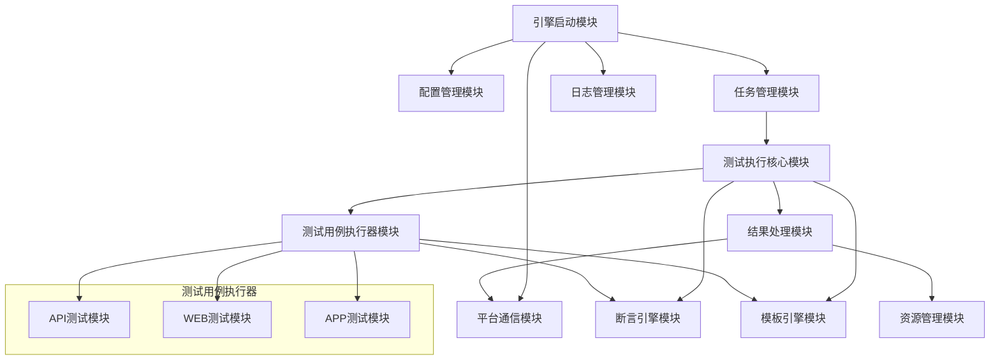
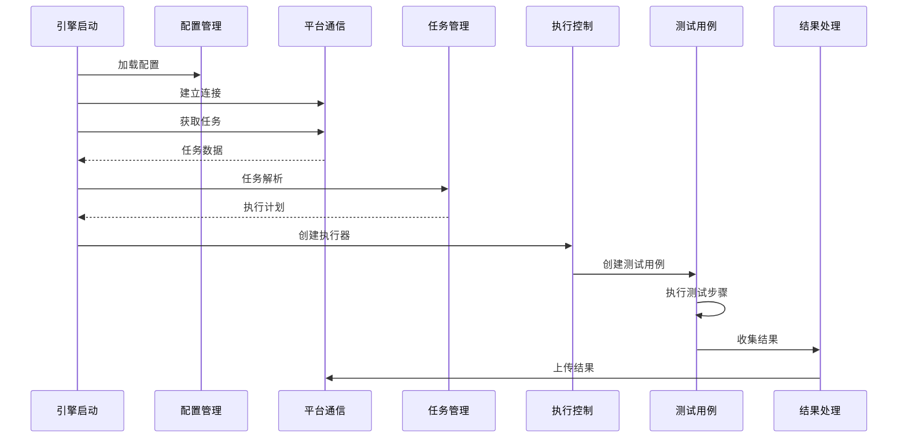

# auto-engine 功能模块设计

## 概述

LiuMa-engine 采用分层模块化架构设计，将系统功能划分为多个独立且相互协作的模块。本文档详细描述了各功能模块的职责划分、内部结构、对外接口以及模块间的依赖关系，为系统的开发、维护和扩展提供清晰的架构指导。

## 模块划分与功能说明

### 1. 引擎启动与管理模块 (start)

**模块职责：**

- 系统启动控制和生命周期管理
- 平台连接建立和心跳维护
- 任务调度和执行控制
- 系统状态监控和异常处理

**核心类与方法：**

```python
class Start:
    """
    引擎启动控制类
    负责系统初始化、任务调度和生命周期管理
    """
    
    def __init__(self):
        """初始化引擎配置和连接参数"""
        pass
    
    def run_test(self, task_data: dict) -> bool:
        """
        执行测试任务
        @param task_data: 任务数据字典
        @return: 执行成功标志
        """
        pass
    
    def push_result(self) -> None:
        """
        监控和推送测试结果
        定期检查结果队列并批量上传到平台
        """
        pass
    
    def heart_beat(self) -> bool:
        """
        发送心跳请求
        @return: 心跳成功标志
        """
        pass
    
    def stop_engine(self) -> None:
        """
        优雅停止引擎
        清理资源并断开连接
        """
        pass
```

**功能特性：**
- 支持多任务并发执行，最大并发数可配置
- 实现任务队列管理，支持任务优先级
- 提供系统健康检查和自动恢复机制
- 支持热重启和配置热更新

### 2. 配置管理模块 (config)

**模块职责：**
- 系统配置文件读取和解析
- 配置参数验证和默认值处理
- 运行时配置更新和持久化
- 敏感信息加密和安全管理

**核心类与方法：**

```python
class Config:
    """
    配置管理类
    提供统一的配置访问接口
    """
    
    def __init__(self, config_path: str = "config/config.ini"):
        """
        初始化配置管理器
        @param config_path: 配置文件路径
        """
        pass
    
    def get_platform_config(self) -> dict:
        """
        获取平台连接配置
        @return: 平台配置字典
        """
        pass
    
    def get_engine_config(self) -> dict:
        """
        获取引擎运行配置
        @return: 引擎配置字典
        """
        pass
    
    def update_token(self, new_token: str) -> bool:
        """
        更新访问令牌
        @param new_token: 新的访问令牌
        @return: 更新成功标志
        """
        pass
    
    def validate_config(self) -> list:
        """
        验证配置完整性
        @return: 验证错误列表
        """
        pass
```

**配置结构：**
- Platform: 平台连接参数（URL、错误详情开关）
- Engine: 引擎身份信息（编码、密钥）
- Header: HTTP请求头配置（Token、Content-Type）
- WebDriver: 浏览器驱动配置（选项、路径）
- RunSetting: 运行时设置（最大并发数）

### 3. 平台通信模块 (api, ws)

**模块职责：**
- 与测试平台的HTTP API通信
- WebSocket长连接管理和消息处理
- 任务数据获取和结果上传
- 网络异常处理和重连机制

**核心类与方法：**

```python
class Api:
    """
    平台API通信类
    处理与测试平台的HTTP通信
    """
    
    def fetch_task(self) -> dict:
        """
        从平台获取待执行任务
        @return: 任务数据字典
        """
        pass
    
    def upload_result(self, results: list) -> bool:
        """
        批量上传测试结果
        @param results: 结果数据列表
        @return: 上传成功标志
        """
        pass
    
    def report_status(self, status: str) -> bool:
        """
        报告引擎状态
        @param status: 状态信息
        @return: 报告成功标志
        """
        pass

class WebSocket:
    """
    WebSocket通信类
    处理实时消息通信
    """
    
    def connect(self) -> bool:
        """
        建立WebSocket连接
        @return: 连接成功标志
        """
        pass
    
    def listen_messages(self) -> None:
        """
        监听平台消息
        处理任务控制指令
        """
        pass
    
    def send_heartbeat(self) -> bool:
        """
        发送心跳消息
        @return: 发送成功标志
        """
        pass
```

**通信协议：**
- HTTP API: RESTful接口，JSON数据格式
- WebSocket: 实时双向通信，支持心跳保活
- 数据加密: HTTPS/WSS安全传输
- 重试机制: 指数退避算法，最大重试次数限制

### 4. 任务管理与执行模块 (setting, run)

**模块职责：**
- 任务数据下载和解析
- 测试计划生成和执行调度
- 线程池管理和资源分配
- 执行状态监控和控制

**核心类与方法：**

```python
class Setting:
    """
    任务设置类
    负责任务数据处理和执行计划生成
    """
    
    def task_analysis(self, task_data: dict) -> dict:
        """
        分析任务数据并生成执行计划
        @param task_data: 原始任务数据
        @return: 执行计划字典
        """
        pass
    
    def download_test_data(self, download_url: str, task_id: str) -> bool:
        """
        下载测试数据文件
        @param download_url: 下载地址
        @param task_id: 任务ID
        @return: 下载成功标志
        """
        pass
    
    def parse_test_collections(self, task_id: str) -> list:
        """
        解析测试集合数据
        @param task_id: 任务ID
        @return: 测试集合列表
        """
        pass

class Run:
    """
    执行控制类
    负责测试用例的实际执行
    """
    
    def __init__(self, test_plan: dict, run_index: int, result: object, lock: object, queue: object):
        """
        初始化执行控制器
        @param test_plan: 测试计划
        @param run_index: 运行索引
        @param result: 结果收集器
        @param lock: 线程锁
        @param queue: 结果队列
        """
        pass
    
    def run_test(self) -> None:
        """
        执行测试计划
        创建测试套件并运行
        """
        pass
    
    def create_test_case(self, case_info: dict) -> object:
        """
        动态创建测试用例实例
        @param case_info: 用例信息
        @return: 测试用例对象
        """
        pass
```

**执行策略：**
- 按测试集合分组并发执行
- 集合内用例按顺序串行执行
- 支持失败重试和超时控制
- 实现资源隔离和异常恢复

### 5. 测试执行核心模块 (case)

**模块职责：**
- 测试用例基础框架和生命周期管理
- 执行上下文管理和参数传递
- 事务记录和结果收集
- 驱动对象管理和资源清理

**核心类与方法：**

```python
class Case(unittest.TestCase):
    """
    测试用例基类
    提供统一的测试执行框架
    """
    
    def setUp(self) -> None:
        """
        用例前置处理
        初始化执行环境和上下文
        """
        pass
    
    def tearDown(self) -> None:
        """
        用例后置处理
        清理资源和保存结果
        """
        pass
    
    def testEntrance(self) -> None:
        """
        测试入口方法
        执行具体的测试逻辑
        """
        pass
    
    def add_transaction(self, trans_name: str, status: int, log: str = "", screenshot: str = "") -> None:
        """
        添加事务记录
        @param trans_name: 事务名称
        @param status: 执行状态
        @param log: 日志信息
        @param screenshot: 截图路径
        """
        pass
    
    def take_screenshot(self, name: str) -> str:
        """
        截图保存
        @param name: 截图名称
        @return: 截图文件路径
        """
        pass
```

**生命周期管理：**
- setUp: 环境初始化、驱动创建、上下文设置
- testEntrance: 核心测试逻辑执行
- tearDown: 资源清理、结果保存、驱动关闭
- 异常处理: 自动截图、错误记录、资源释放

### 6. 断言引擎模块 (core.assertion)

**模块职责：**
- 多种断言类型的实现和扩展
- 数据类型自动转换和格式化
- 断言结果记录和失败分析
- 自定义断言规则支持

**核心类与方法：**

```python
class Assert:
    """
    断言引擎类
    提供丰富的断言验证功能
    """
    
    def assert_equal(self, actual: any, expected: any, message: str = "") -> bool:
        """
        相等断言
        @param actual: 实际值
        @param expected: 期望值
        @param message: 断言消息
        @return: 断言结果
        """
        pass
    
    def assert_contains(self, actual: any, expected: any, message: str = "") -> bool:
        """
        包含断言
        @param actual: 实际值
        @param expected: 期望值
        @param message: 断言消息
        @return: 断言结果
        """
        pass
    
    def assert_greater(self, actual: any, expected: any, message: str = "") -> bool:
        """
        大于断言
        @param actual: 实际值
        @param expected: 期望值
        @param message: 断言消息
        @return: 断言结果
        """
        pass
    
    def assert_regex(self, actual: str, pattern: str, message: str = "") -> bool:
        """
        正则表达式断言
        @param actual: 实际字符串
        @param pattern: 正则表达式
        @param message: 断言消息
        @return: 断言结果
        """
        pass
    
    def convert_type(self, value: any, target_type: type) -> any:
        """
        数据类型转换
        @param value: 原始值
        @param target_type: 目标类型
        @return: 转换后的值
        """
        pass
```

**断言类型支持：**
- 基础断言: equal, not_equal, contains, not_contains
- 数值断言: greater, greater_equal, less, less_equal
- 字符串断言: startswith, endswith, regex_match
- 集合断言: in, not_in, length_equal, length_greater
- 类型断言: type_match, is_null, is_not_null

### 7. 模板引擎模块 (core.template)

**模块职责：**
- 参数化测试数据的模板渲染
- 上下文变量和函数调用处理
- JSONPath表达式解析和数据提取
- 动态参数生成和关联

**核心类与方法：**

```python
class Template:
    """
    模板引擎类
    处理参数化数据的渲染和替换
    """
    
    def __init__(self, context: dict = None, params: dict = None):
        """
        初始化模板引擎
        @param context: 上下文变量字典
        @param params: 公共参数字典
        """
        pass
    
    def render(self, template_str: str) -> str:
        """
        渲染模板字符串
        @param template_str: 模板字符串
        @return: 渲染后的字符串
        """
        pass
    
    def replace_param(self, text: str) -> str:
        """
        替换参数占位符
        @param text: 原始文本
        @return: 替换后的文本
        """
        pass
    
    def extract_jsonpath(self, data: dict, path: str) -> any:
        """
        JSONPath数据提取
        @param data: 数据对象
        @param path: JSONPath表达式
        @return: 提取的值
        """
        pass
    
    def call_function(self, func_name: str, *args) -> any:
        """
        调用内置函数
        @param func_name: 函数名
        @param args: 函数参数
        @return: 函数返回值
        """
        pass
```

**模板语法：**
- 参数引用: `#{param_name}` 或 `${param_name}`
- 函数调用: `@function_name(arg1, arg2)`
- JSONPath: `response.data[0].id`
- 条件渲染: 支持简单的条件判断

### 8. 测试用例执行器模块 (core.api, core.web, core.app)

**模块职责：**
- 不同测试类型的具体实现
- 测试步骤的执行和结果处理
- 驱动对象的管理和操作
- 平台特定功能的封装

#### 8.1 API测试模块 (core.api)

```python
class ApiTestCase(Case):
    """
    API测试用例类
    继承自Case，实现API测试逻辑
    """
    
    def setUp(self) -> None:
        """
        初始化HTTP会话
        """
        pass
    
    def execute_request(self, step_data: dict) -> dict:
        """
        执行HTTP请求
        @param step_data: 步骤数据
        @return: 响应数据
        """
        pass

class ApiTestStep:
    """
    API测试步骤类
    封装单个API请求的执行逻辑
    """
    
    def send_request(self, method: str, url: str, **kwargs) -> requests.Response:
        """
        发送HTTP请求
        @param method: 请求方法
        @param url: 请求URL
        @param kwargs: 其他请求参数
        @return: 响应对象
        """
        pass

class ApiRequestCollector:
    """
    API请求收集器
    收集和管理API请求信息
    """
    
    def collect_request_info(self, request: requests.Request) -> dict:
        """
        收集请求信息
        @param request: 请求对象
        @return: 请求信息字典
        """
        pass
```

#### 8.2 WEB测试模块 (core.web)

```python
class WebTestCase(Case):
    """
    WEB测试用例类
    基于Selenium实现WEB自动化测试
    """
    
    def setUp(self) -> None:
        """
        初始化浏览器驱动
        """
        pass
    
    def execute_action(self, action_data: dict) -> bool:
        """
        执行WEB操作
        @param action_data: 操作数据
        @return: 执行成功标志
        """
        pass

class WebTestStep:
    """
    WEB测试步骤类
    封装单个WEB操作的执行逻辑
    """
    
    def click_element(self, locator: dict) -> bool:
        """
        点击元素
        @param locator: 元素定位信息
        @return: 操作成功标志
        """
        pass
    
    def input_text(self, locator: dict, text: str) -> bool:
        """
        输入文本
        @param locator: 元素定位信息
        @param text: 输入文本
        @return: 操作成功标志
        """
        pass
```

#### 8.3 APP测试模块 (core.app)

```python
class AppTestCase(Case):
    """
    APP测试用例类
    基于uiautomator2/facebook-wda实现移动端自动化测试
    """
    
    def setUp(self) -> None:
        """
        初始化移动设备连接
        """
        pass
    
    def execute_gesture(self, gesture_data: dict) -> bool:
        """
        执行手势操作
        @param gesture_data: 手势数据
        @return: 执行成功标志
        """
        pass

class AppTestStep:
    """
    APP测试步骤类
    封装单个APP操作的执行逻辑
    """
    
    def tap_element(self, locator: dict) -> bool:
        """
        点击元素
        @param locator: 元素定位信息
        @return: 操作成功标志
        """
        pass
    
    def swipe_screen(self, direction: str, distance: int) -> bool:
        """
        滑动屏幕
        @param direction: 滑动方向
        @param distance: 滑动距离
        @return: 操作成功标志
        """
        pass
```

### 9. 结果处理模块 (result, report)

**模块职责：**
- 测试结果的收集和格式化
- 结果数据的批量处理和上传
- 执行统计和报告生成
- 结果数据的持久化存储

**核心类与方法：**

```python
class Result(unittest.TestResult):
    """
    测试结果收集类
    继承自unittest.TestResult，扩展结果收集功能
    """
    
    def startTest(self, test: unittest.TestCase) -> None:
        """
        测试开始时的处理
        @param test: 测试用例对象
        """
        pass
    
    def stopTest(self, test: unittest.TestCase) -> None:
        """
        测试结束时的处理
        @param test: 测试用例对象
        """
        pass
    
    def addSuccess(self, test: unittest.TestCase) -> None:
        """
        添加成功结果
        @param test: 测试用例对象
        """
        pass
    
    def addError(self, test: unittest.TestCase, err: tuple) -> None:
        """
        添加错误结果
        @param test: 测试用例对象
        @param err: 错误信息
        """
        pass
    
    def addFailure(self, test: unittest.TestCase, err: tuple) -> None:
        """
        添加失败结果
        @param test: 测试用例对象
        @param err: 失败信息
        """
        pass

class Report:
    """
    结果报告类
    负责结果数据的处理和上传
    """
    
    def monitor_result(self) -> None:
        """
        监控结果队列
        定期批量上传结果数据
        """
        pass
    
    def format_result(self, result_data: dict) -> dict:
        """
        格式化结果数据
        @param result_data: 原始结果数据
        @return: 格式化后的结果数据
        """
        pass
    
    def batch_upload(self, results: list) -> bool:
        """
        批量上传结果
        @param results: 结果数据列表
        @return: 上传成功标志
        """
        pass
```

### 10. 资源管理模块 (upload)

**模块职责：**
- 截图文件的自动上传和管理
- 测试数据文件的下载和清理
- 日志文件的轮转和归档
- 临时资源的生命周期管理

**核心类与方法：**

```python
class Upload:
    """
    资源上传类
    管理文件资源的上传和清理
    """
    
    def set_upload(self) -> None:
        """
        启动上传监控
        定期扫描并上传文件资源
        """
        pass
    
    def upload_file(self, file_path: str) -> bool:
        """
        上传单个文件
        @param file_path: 文件路径
        @return: 上传成功标志
        """
        pass
    
    def scan_upload_files(self) -> list:
        """
        扫描待上传文件
        @return: 文件路径列表
        """
        pass
    
    def cleanup_uploaded_files(self) -> None:
        """
        清理已上传文件
        删除本地临时文件
        """
        pass
```

### 11. 日志管理模块 (log)

**模块职责：**
- 分类日志记录和管理
- 日志格式化和输出控制
- 日志文件轮转和清理
- 调试信息和错误追踪

**核心类与方法：**

```python
class Logger:
    """
    日志管理类
    提供统一的日志记录接口
    """
    
    def __init__(self, name: str, level: str = "INFO"):
        """
        初始化日志记录器
        @param name: 日志名称
        @param level: 日志级别
        """
        pass
    
    def get_handler(self, log_file: str) -> logging.FileHandler:
        """
        获取文件处理器
        @param log_file: 日志文件路径
        @return: 文件处理器对象
        """
        pass
    
    def debug(self, message: str) -> None:
        """
        记录调试日志
        @param message: 日志消息
        """
        pass
    
    def error(self, message: str) -> None:
        """
        记录错误日志
        @param message: 日志消息
        """
        pass

def DebugLogger(message: str) -> None:
    """
    调试日志记录函数
    @param message: 调试消息
    """
    pass

def ErrorLogger(message: str) -> None:
    """
    错误日志记录函数
    @param message: 错误消息
    """
    pass
```

## 模块间依赖关系

### 1. 依赖层次结构



### 2. 核心依赖关系

**启动控制层依赖：**
- `_start` → `_config`: 获取系统配置
- `_start` → `_api`: 平台通信和任务获取
- `_start` → `_setting`: 任务解析和计划生成
- `_start` → `_log`: 系统日志记录

**任务执行层依赖：**
- `_setting` → `_run`: 执行计划传递
- `_run` → `_case`: 测试用例创建和执行
- `_case` → `core.assertion`: 断言验证
- `_case` → `core.template`: 参数渲染

**结果处理层依赖：**
- `_result` → `_report`: 结果数据传递
- `_report` → `_api`: 结果上传
- `_upload` → `_api`: 文件上传

**测试执行器依赖：**
- `core.api` → `requests`: HTTP请求库
- `core.web` → `selenium`: 浏览器自动化
- `core.app` → `uiautomator2/facebook-wda`: 移动端自动化

### 3. 数据流转关系



### 4. 配置依赖关系

**配置传递链：**
```
config.ini → Config → 各模块配置属性
```

**配置使用模块：**
- `_start`: 引擎运行配置、平台连接配置
- `_api`: HTTP请求头配置、平台地址配置
- `_ws`: WebSocket连接配置
- `core.web`: 浏览器驱动配置
- `_log`: 日志级别和输出配置

## 接口设计规范

### 1. 内部接口规范

**类初始化接口：**
```python
class ModuleClass:
    def __init__(self, required_param: type, optional_param: type = default_value):
        """
        模块初始化方法
        @param required_param: 必需参数说明
        @param optional_param: 可选参数说明
        """
        pass
```

**方法定义接口：**
```python
def method_name(self, param1: type, param2: type = None) -> return_type:
    """
    方法功能描述
    @param param1: 参数1说明
    @param param2: 参数2说明
    @return: 返回值说明
    @raises: 可能抛出的异常
    """
    pass
```

**异常处理接口：**
```python
try:
    # 业务逻辑
    result = self.execute_operation()
except SpecificException as e:
    # 特定异常处理
    self.handle_specific_error(e)
except Exception as e:
    # 通用异常处理
    self.handle_general_error(e)
finally:
    # 资源清理
    self.cleanup_resources()
```

### 2. 外部接口规范

**平台接口调用：**
```python
class PlatformInterface:
    def call_api(self, endpoint: str, method: str = "GET", data: dict = None) -> dict:
        """
        调用平台API接口
        @param endpoint: 接口端点
        @param method: HTTP方法
        @param data: 请求数据
        @return: 响应数据字典
        """
        headers = self.get_request_headers()
        url = f"{self.base_url}/{endpoint}"
        
        try:
            response = requests.request(method, url, json=data, headers=headers)
            response.raise_for_status()
            return response.json()
        except requests.RequestException as e:
            self.handle_request_error(e)
            raise
```

**WebSocket接口：**
```python
class WebSocketInterface:
    def on_message(self, message: str) -> None:
        """
        WebSocket消息处理接口
        @param message: 接收到的消息
        """
        try:
            data = json.loads(message)
            message_type = data.get('type')
            
            if message_type == 'task_control':
                self.handle_task_control(data)
            elif message_type == 'engine_command':
                self.handle_engine_command(data)
            else:
                self.handle_unknown_message(data)
        except json.JSONDecodeError:
            self.handle_invalid_message(message)
```

### 3. 数据接口规范

**任务数据格式：**
```python
TaskDataSchema = {
    "taskId": str,              # 必需：任务唯一标识
    "taskType": str,            # 必需：任务类型（normal/debug）
    "maxThread": int,           # 必需：最大并发线程数
    "reRun": bool,              # 可选：是否支持失败重试
    "downloadUrl": str,         # 必需：测试数据下载地址
    "debugData": dict,          # 可选：调试模式数据
    "testCollectionList": [     # 必需：测试集合列表
        {
            "collectionId": str,    # 必需：测试集合ID
            "testCaseList": [       # 必需：测试用例列表
                {
                    "caseId": str,      # 必需：用例ID
                    "caseType": str,    # 必需：用例类型（API/WEB/APP）
                    "index": int        # 必需：执行索引
                }
            ]
        }
    ]
}
```

**结果数据格式：**
```python
ResultDataSchema = {
    "taskId": str,              # 必需：任务ID
    "collectionId": str,        # 必需：测试集合ID
    "caseId": str,              # 必需：用例ID
    "index": int,               # 必需：执行索引
    "runIndex": int,            # 必需：运行轮次
    "status": int,              # 必需：执行状态（0:成功 1:失败 2:错误）
    "startTime": str,           # 必需：开始时间（ISO格式）
    "endTime": str,             # 必需：结束时间（ISO格式）
    "during": int,              # 必需：执行时长（毫秒）
    "transList": [              # 必需：事务列表
        {
            "id": str,              # 必需：事务ID
            "name": str,            # 必需：事务名称
            "content": str,         # 可选：事务内容
            "description": str,     # 可选：事务描述
            "status": int,          # 必需：事务状态
            "during": int,          # 必需：执行时长（毫秒）
            "log": str,             # 可选：日志信息
            "screenShotList": [str] # 可选：截图文件列表
        }
    ]
}
```

### 4. 错误处理接口规范

**统一错误响应格式：**
```python
ErrorResponseSchema = {
    "success": False,           # 必需：操作成功标志
    "errorCode": str,           # 必需：错误代码
    "errorMessage": str,        # 必需：错误消息
    "errorDetails": dict,       # 可选：错误详细信息
    "timestamp": str,           # 必需：错误发生时间
    "requestId": str            # 可选：请求ID（用于追踪）
}
```

**异常处理接口：**
```python
class ErrorHandler:
    def handle_error(self, error: Exception, context: dict = None) -> dict:
        """
        统一错误处理接口
        @param error: 异常对象
        @param context: 错误上下文信息
        @return: 标准化错误响应
        """
        error_response = {
            "success": False,
            "errorCode": self.get_error_code(error),
            "errorMessage": str(error),
            "timestamp": datetime.now().isoformat()
        }
        
        if context:
            error_response["errorDetails"] = context
        
        # 记录错误日志
        ErrorLogger(f"错误处理: {error_response}")
        
        return error_response
```

## 模块扩展指南

### 1. 新增测试类型模块

**步骤说明：**
1. 在 `core/` 目录下创建新的测试类型目录
2. 实现 `TestCase`、`TestStep`、`Collector` 三个核心类
3. 继承 `Case` 基类，实现特定的测试逻辑
4. 在 `_run.py` 中注册新的测试类型

**示例代码：**
```python
# core/database/testcase.py
class DatabaseTestCase(Case):
    """
    数据库测试用例类
    实现数据库自动化测试功能
    """
    
    def setUp(self) -> None:
        """初始化数据库连接"""
        self.db_connection = self.create_db_connection()
    
    def tearDown(self) -> None:
        """关闭数据库连接"""
        if hasattr(self, 'db_connection'):
            self.db_connection.close()
    
    def testEntrance(self) -> None:
        """数据库测试入口"""
        for step_data in self.test_data.get('steps', []):
            self.execute_db_step(step_data)
```

### 2. 新增断言类型

**步骤说明：**
1. 在 `core/assertion.py` 中添加新的断言方法
2. 实现断言逻辑和错误处理
3. 更新断言类型映射表
4. 添加相应的单元测试

**示例代码：**
```python
def assert_json_schema(self, actual: dict, schema: dict, message: str = "") -> bool:
    """
    JSON Schema断言
    @param actual: 实际JSON数据
    @param schema: JSON Schema定义
    @param message: 断言消息
    @return: 断言结果
    """
    try:
        jsonschema.validate(actual, schema)
        return True
    except jsonschema.ValidationError as e:
        self.record_assertion_failure("json_schema", actual, schema, str(e))
        return False
```

### 3. 新增模板函数

**步骤说明：**
1. 在 `core/template.py` 中添加新的函数实现
2. 在函数库中注册新函数
3. 实现参数验证和错误处理
4. 更新函数文档和使用示例

**示例代码：**
```python
def generate_uuid(self) -> str:
    """
    生成UUID字符串
    @return: UUID字符串
    """
    return str(uuid.uuid4())

def format_timestamp(self, format_str: str = "%Y-%m-%d %H:%M:%S") -> str:
    """
    格式化当前时间戳
    @param format_str: 时间格式字符串
    @return: 格式化后的时间字符串
    """
    return datetime.now().strftime(format_str)
```

---

> **文档说明：** 本功能模块设计文档详细描述了 LiuMa-engine 的模块化架构设计，包括各模块的职责划分、接口定义、依赖关系和扩展指南。文档为系统的开发、维护和功能扩展提供了完整的架构参考。

> **设计原则：** 系统采用分层模块化设计，遵循单一职责、开闭原则、依赖倒置等设计原则，确保系统的可维护性、可扩展性和可测试性。各模块间通过明确的接口进行交互，降低耦合度，提高系统的稳定性和灵活性。