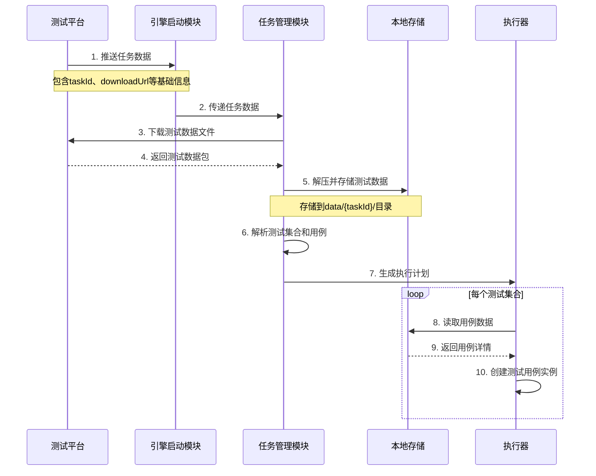
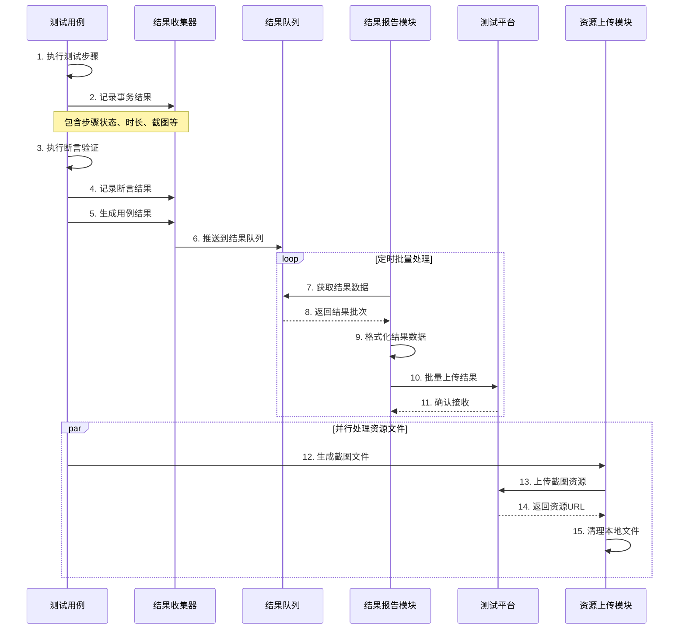
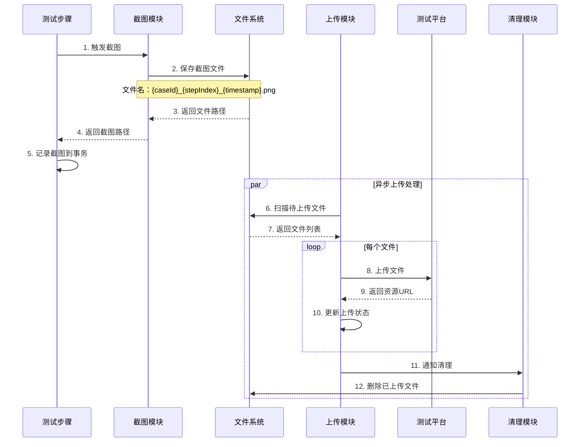
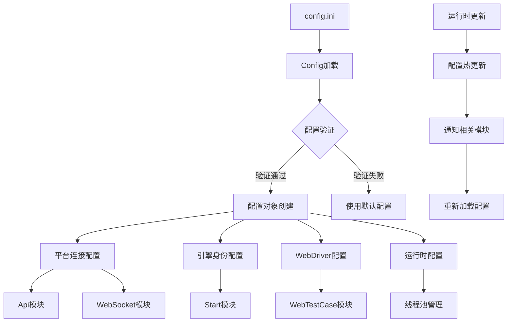

# auto-engine 数据设计

## 概述

LiuMa-engine 的数据设计采用分层存储和流式处理的架构模式，通过合理的数据结构设计和高效的数据流转机制，确保系统在高并发测试场景下的稳定性和性能。本文档详细描述了系统的核心数据结构、数据流转过程、存储方案设计以及数据安全和生命周期管理策略。

## 主要数据结构

### 1. 任务数据结构

#### 1.1 Task（任务）

```python
class Task:
    """
    任务数据结构
    描述从平台接收的完整任务信息
    """
    
    def __init__(self):
        self.taskId: str = ""           # 任务唯一标识符
        self.taskType: str = ""         # 任务类型：normal（正常）、debug（调试）
        self.maxThread: int = 1         # 最大并发线程数，控制执行并发度
        self.reRun: bool = False        # 失败重试标志，是否支持失败用例重新执行
        self.downloadUrl: str = ""      # 测试数据下载地址，包含完整的测试用例数据
        self.debugData: dict = {}       # 调试模式专用数据，包含调试参数和配置
        self.testCollectionList: list = []  # 测试集合列表，包含所有待执行的测试集合
        self.createTime: str = ""       # 任务创建时间，ISO格式时间戳
        self.priority: int = 0          # 任务优先级，数值越大优先级越高
        self.timeout: int = 3600        # 任务超时时间（秒），防止任务无限执行
        
    def to_dict(self) -> dict:
        """
        转换为字典格式
        @return: 任务数据字典
        """
        return {
            "taskId": self.taskId,
            "taskType": self.taskType,
            "maxThread": self.maxThread,
            "reRun": self.reRun,
            "downloadUrl": self.downloadUrl,
            "debugData": self.debugData,
            "testCollectionList": self.testCollectionList,
            "createTime": self.createTime,
            "priority": self.priority,
            "timeout": self.timeout
        }
    
    def validate(self) -> list:
        """
        验证任务数据完整性
        @return: 验证错误列表
        """
        errors = []
        if not self.taskId:
            errors.append("任务ID不能为空")
        if not self.taskType:
            errors.append("任务类型不能为空")
        if self.maxThread <= 0:
            errors.append("最大线程数必须大于0")
        if not self.downloadUrl:
            errors.append("下载地址不能为空")
        return errors
```

#### 1.2 TestCollection（测试集合）

```python
class TestCollection:
    """
    测试集合数据结构
    表示一组相关的测试用例集合
    """
    
    def __init__(self):
        self.collectionId: str = ""     # 测试集合唯一标识符
        self.collectionName: str = ""   # 测试集合名称
        self.description: str = ""      # 集合描述信息
        self.testCaseList: list = []    # 测试用例列表
        self.setupScript: str = ""      # 集合前置脚本
        self.teardownScript: str = ""   # 集合后置脚本
        self.variables: dict = {}       # 集合级变量
        self.parallel: bool = False     # 是否支持并行执行
        self.order: int = 0             # 执行顺序
        
    def get_case_count(self) -> int:
        """
        获取用例数量
        @return: 用例总数
        """
        return len(self.testCaseList)
    
    def get_cases_by_type(self, case_type: str) -> list:
        """
        按类型获取用例列表
        @param case_type: 用例类型（API/WEB/APP）
        @return: 指定类型的用例列表
        """
        return [case for case in self.testCaseList if case.get('caseType') == case_type]
```

#### 1.3 TestCase（测试用例）

```python
class TestCase:
    """
    测试用例数据结构
    描述单个测试用例的完整信息
    """
    
    def __init__(self):
        self.caseId: str = ""           # 用例唯一标识符
        self.caseName: str = ""         # 用例名称
        self.caseType: str = ""         # 用例类型：API、WEB、APP
        self.description: str = ""      # 用例描述
        self.index: int = 0             # 执行索引，用于排序
        self.priority: int = 0          # 用例优先级
        self.timeout: int = 300         # 用例超时时间（秒）
        self.retry: int = 0             # 重试次数
        self.tags: list = []            # 用例标签
        self.dependencies: list = []    # 依赖的其他用例ID
        
        # 测试步骤和数据
        self.steps: list = []           # 测试步骤列表
        self.setupData: dict = {}       # 前置数据
        self.teardownData: dict = {}    # 后置数据
        self.variables: dict = {}       # 用例级变量
        self.assertions: list = []      # 断言列表
        
        # 执行控制
        self.enabled: bool = True       # 是否启用
        self.skipReason: str = ""       # 跳过原因
        
    def is_executable(self) -> bool:
        """
        判断用例是否可执行
        @return: 可执行标志
        """
        return self.enabled and bool(self.steps)
    
    def get_step_count(self) -> int:
        """
        获取步骤数量
        @return: 步骤总数
        """
        return len(self.steps)
    
    def estimate_duration(self) -> int:
        """
        估算执行时长
        @return: 预估时长（秒）
        """
        base_time = len(self.steps) * 5  # 每步骤平均5秒
        if self.caseType == "WEB":
            base_time *= 2  # WEB测试时间翻倍
        elif self.caseType == "APP":
            base_time *= 1.5  # APP测试时间增加50%
        return min(base_time, self.timeout)
```

### 2. 执行结果数据结构

#### 2.1 CaseResult（用例结果）

```python
class CaseResult:
    """
    测试用例执行结果数据结构
    记录用例执行的完整信息
    """
    
    def __init__(self):
        # 基础标识信息
        self.taskId: str = ""           # 任务ID
        self.collectionId: str = ""     # 测试集合ID
        self.caseId: str = ""           # 用例ID
        self.index: int = 0             # 执行索引
        self.runIndex: int = 0          # 运行轮次（重试时递增）
        
        # 执行状态信息
        self.status: int = 0            # 执行状态：0-成功，1-失败，2-错误，3-跳过
        self.startTime: str = ""        # 开始时间（ISO格式）
        self.endTime: str = ""          # 结束时间（ISO格式）
        self.during: int = 0            # 执行时长（毫秒）
        
        # 执行详情
        self.transList: list = []       # 事务列表（步骤执行记录）
        self.errorMessage: str = ""     # 错误消息
        self.stackTrace: str = ""       # 错误堆栈
        self.logs: list = []            # 执行日志
        
        # 资源文件
        self.screenshots: list = []     # 截图文件列表
        self.attachments: list = []     # 附件文件列表
        
        # 统计信息
        self.assertionCount: int = 0    # 断言总数
        self.passedAssertions: int = 0  # 通过的断言数
        self.failedAssertions: int = 0  # 失败的断言数
        
    def calculate_duration(self) -> None:
        """
        计算执行时长
        基于开始和结束时间计算毫秒级时长
        """
        if self.startTime and self.endTime:
            start = datetime.fromisoformat(self.startTime.replace('Z', '+00:00'))
            end = datetime.fromisoformat(self.endTime.replace('Z', '+00:00'))
            self.during = int((end - start).total_seconds() * 1000)
    
    def add_transaction(self, transaction: dict) -> None:
        """
        添加事务记录
        @param transaction: 事务数据
        """
        self.transList.append(transaction)
    
    def is_success(self) -> bool:
        """
        判断是否执行成功
        @return: 成功标志
        """
        return self.status == 0
    
    def get_failure_summary(self) -> str:
        """
        获取失败摘要
        @return: 失败原因摘要
        """
        if self.status == 0:
            return "执行成功"
        elif self.status == 1:
            return f"断言失败: {self.failedAssertions}/{self.assertionCount}"
        elif self.status == 2:
            return f"执行错误: {self.errorMessage}"
        elif self.status == 3:
            return "用例跳过"
        else:
            return "未知状态"
```

#### 2.2 Transaction（事务记录）

```python
class Transaction:
    """
    事务记录数据结构
    记录测试步骤的执行详情
    """
    
    def __init__(self):
        self.id: str = ""               # 事务唯一标识
        self.name: str = ""             # 事务名称
        self.content: str = ""          # 事务内容描述
        self.description: str = ""      # 详细描述
        self.status: int = 0            # 执行状态：0-成功，1-失败，2-错误
        self.during: int = 0            # 执行时长（毫秒）
        self.startTime: str = ""        # 开始时间
        self.endTime: str = ""          # 结束时间
        self.log: str = ""              # 执行日志
        self.screenShotList: list = []  # 截图文件列表
        self.requestData: dict = {}     # 请求数据（API测试）
        self.responseData: dict = {}    # 响应数据（API测试）
        self.elementInfo: dict = {}     # 元素信息（WEB/APP测试）
        self.assertionResults: list = []# 断言结果列表
        
    def add_screenshot(self, screenshot_path: str) -> None:
        """
        添加截图
        @param screenshot_path: 截图文件路径
        """
        if screenshot_path and screenshot_path not in self.screenShotList:
            self.screenShotList.append(screenshot_path)
    
    def add_assertion_result(self, assertion: dict) -> None:
        """
        添加断言结果
        @param assertion: 断言结果数据
        """
        self.assertionResults.append(assertion)
    
    def set_error(self, error_message: str) -> None:
        """
        设置错误信息
        @param error_message: 错误消息
        """
        self.status = 2
        self.log = error_message
```

### 3. 断言数据结构

#### 3.1 AssertData（断言数据）

```python
class AssertData:
    """
    断言数据结构
    描述断言验证的完整信息
    """
    
    def __init__(self):
        self.id: str = ""               # 断言唯一标识
        self.name: str = ""             # 断言名称
        self.type: str = ""             # 断言类型：equal、contains、greater等
        self.actual: any = None         # 实际值
        self.expected: any = None       # 期望值
        self.operator: str = ""         # 操作符
        self.message: str = ""          # 断言消息
        self.result: bool = False       # 断言结果
        self.errorMessage: str = ""     # 错误消息
        self.executeTime: str = ""      # 执行时间
        self.during: int = 0            # 执行时长（毫秒）
        
        # 高级断言配置
        self.ignoreCase: bool = False   # 忽略大小写（字符串断言）
        self.precision: int = 2         # 精度（数值断言）
        self.timeout: int = 5000        # 超时时间（毫秒）
        self.retryInterval: int = 500   # 重试间隔（毫秒）
        
    def execute(self) -> bool:
        """
        执行断言验证
        @return: 断言结果
        """
        start_time = time.time()
        try:
            # 根据断言类型执行相应的验证逻辑
            self.result = self._perform_assertion()
            if not self.result:
                self.errorMessage = f"断言失败: 期望 {self.expected}，实际 {self.actual}"
        except Exception as e:
            self.result = False
            self.errorMessage = f"断言执行异常: {str(e)}"
        finally:
            self.during = int((time.time() - start_time) * 1000)
            self.executeTime = datetime.now().isoformat()
        
        return self.result
    
    def _perform_assertion(self) -> bool:
        """
        执行具体的断言逻辑
        @return: 断言结果
        """
        # 根据断言类型执行相应的验证
        if self.type == "equal":
            return self._assert_equal()
        elif self.type == "contains":
            return self._assert_contains()
        elif self.type == "greater":
            return self._assert_greater()
        # ... 其他断言类型
        else:
            raise ValueError(f"不支持的断言类型: {self.type}")
    
    def to_dict(self) -> dict:
        """
        转换为字典格式
        @return: 断言数据字典
        """
        return {
            "id": self.id,
            "name": self.name,
            "type": self.type,
            "actual": self.actual,
            "expected": self.expected,
            "result": self.result,
            "message": self.message,
            "errorMessage": self.errorMessage,
            "executeTime": self.executeTime,
            "during": self.during
        }
```

### 4. 配置数据结构

#### 4.1 EngineConfig（引擎配置）

```python
class EngineConfig:
    """
    引擎配置数据结构
    管理系统运行时的各项配置参数
    """
    
    def __init__(self):
        # 平台连接配置
        self.platform: PlatformConfig = PlatformConfig()
        
        # 引擎身份配置
        self.engine: EngineIdentity = EngineIdentity()
        
        # HTTP请求头配置
        self.headers: HeaderConfig = HeaderConfig()
        
        # WebDriver配置
        self.webdriver: WebDriverConfig = WebDriverConfig()
        
        # 运行时配置
        self.runtime: RuntimeConfig = RuntimeConfig()
        
        # 日志配置
        self.logging: LoggingConfig = LoggingConfig()
        
    def load_from_file(self, config_path: str) -> bool:
        """
        从配置文件加载配置
        @param config_path: 配置文件路径
        @return: 加载成功标志
        """
        try:
            config = configparser.ConfigParser()
            config.read(config_path, encoding='utf-8')
            
            # 加载各个配置段
            self.platform.load_from_config(config)
            self.engine.load_from_config(config)
            self.headers.load_from_config(config)
            self.webdriver.load_from_config(config)
            self.runtime.load_from_config(config)
            self.logging.load_from_config(config)
            
            return True
        except Exception as e:
            print(f"配置加载失败: {e}")
            return False
    
    def validate(self) -> list:
        """
        验证配置完整性
        @return: 验证错误列表
        """
        errors = []
        errors.extend(self.platform.validate())
        errors.extend(self.engine.validate())
        errors.extend(self.headers.validate())
        errors.extend(self.webdriver.validate())
        errors.extend(self.runtime.validate())
        return errors

class PlatformConfig:
    """
    平台连接配置
    """
    def __init__(self):
        self.url: str = ""              # 平台地址
        self.timeout: int = 30          # 连接超时时间
        self.retry_count: int = 3       # 重试次数
        self.error_detail: bool = True  # 错误详情开关
        
class EngineIdentity:
    """
    引擎身份配置
    """
    def __init__(self):
        self.code: str = ""             # 引擎编码
        self.secret: str = ""           # 引擎密钥
        self.version: str = ""          # 引擎版本
        
class HeaderConfig:
    """
    HTTP请求头配置
    """
    def __init__(self):
        self.token: str = ""            # 访问令牌
        self.content_type: str = "application/json"  # 内容类型
        self.user_agent: str = "LiuMa-Engine/1.0"    # 用户代理
        
class WebDriverConfig:
    """
    WebDriver配置
    """
    def __init__(self):
        self.browser: str = "chrome"    # 浏览器类型
        self.headless: bool = True      # 无头模式
        self.window_size: str = "1920,1080"  # 窗口大小
        self.driver_path: str = ""      # 驱动路径
        self.options: list = []         # 浏览器选项
        
class RuntimeConfig:
    """
    运行时配置
    """
    def __init__(self):
        self.max_threads: int = 5       # 最大线程数
        self.result_batch_size: int = 10  # 结果批量上传大小
        self.upload_interval: int = 30  # 上传间隔（秒）
        self.cleanup_interval: int = 3600  # 清理间隔（秒）
        
class LoggingConfig:
    """
    日志配置
    """
    def __init__(self):
        self.level: str = "INFO"        # 日志级别
        self.format: str = "%(asctime)s - %(name)s - %(levelname)s - %(message)s"
        self.file_size: int = 10        # 日志文件大小（MB）
        self.backup_count: int = 5      # 备份文件数量
```

## 数据流转过程

### 1. 任务数据流转



**数据流转详细说明：**

1. **任务接收阶段**
   - 平台通过WebSocket或HTTP推送任务数据
   - 引擎验证任务数据格式和完整性
   - 记录任务接收时间和状态

2. **数据下载阶段**
   - 根据downloadUrl下载测试数据压缩包
   - 验证文件完整性（MD5校验）
   - 解压到指定目录：`data/{taskId}/`

3. **数据解析阶段**
   - 读取测试集合配置文件
   - 解析每个用例的详细信息
   - 构建执行计划和依赖关系

4. **执行准备阶段**
   - 创建线程池和结果收集器
   - 初始化执行上下文和共享变量
   - 分配资源和设置监控

### 2. 执行结果流转



**结果流转详细说明：**

1. **结果生成阶段**
   - 测试用例执行过程中实时记录事务信息
   - 每个测试步骤完成后立即记录结果
   - 断言验证结果即时保存

2. **结果收集阶段**
   - 用例执行完成后生成完整的CaseResult对象
   - 计算执行时长和统计信息
   - 推送到线程安全的结果队列

3. **结果处理阶段**
   - 结果报告模块定时从队列获取数据
   - 批量处理多个用例结果
   - 格式化为平台要求的数据格式

4. **结果上传阶段**
   - 通过HTTP API批量上传结果数据
   - 实现重试机制和错误处理
   - 确认上传成功后清理本地数据

### 3. 资源文件流转



**资源流转详细说明：**

1. **资源生成阶段**
   - 测试步骤执行时自动截图
   - 文件命名规则：`{caseId}_{stepIndex}_{timestamp}.png`
   - 保存到临时目录：`image/{taskId}/`

2. **资源管理阶段**
   - 上传模块定时扫描待上传文件
   - 按文件大小和数量进行批量上传
   - 记录上传状态和重试次数

3. **资源清理阶段**
   - 上传成功后标记文件为可清理
   - 定时清理已上传的本地文件
   - 保留最近的文件用于调试

### 4. 配置数据流转



**配置流转详细说明：**

1. **配置加载阶段**
   - 系统启动时读取config.ini文件
   - 解析各个配置段的参数
   - 验证配置的完整性和有效性

2. **配置分发阶段**
   - 将配置对象传递给各个功能模块
   - 每个模块获取所需的配置参数
   - 建立配置变更的通知机制

3. **配置更新阶段**
   - 支持运行时配置更新
   - 通知相关模块重新加载配置
   - 保持配置的一致性和同步

## 存储方案设计

### 1. 本地存储结构

```
LiuMa-engine/
├── config/                 # 配置文件目录
│   ├── config.ini         # 主配置文件
│   ├── logging.conf       # 日志配置文件
│   └── webdriver/         # WebDriver配置
│       ├── chrome.json    # Chrome浏览器配置
│       └── firefox.json   # Firefox浏览器配置
│
├── data/                  # 测试数据目录
│   ├── {taskId}/          # 按任务ID分组
│   │   ├── collections/   # 测试集合数据
│   │   ├── cases/         # 测试用例数据
│   │   ├── variables/     # 变量数据
│   │   └── resources/     # 资源文件
│   └── temp/              # 临时数据
│
├── image/                 # 截图文件目录
│   ├── {taskId}/          # 按任务ID分组
│   │   ├── {caseId}/      # 按用例ID分组
│   │   └── temp/          # 临时截图
│   └── archive/           # 归档截图
│
├── log/                   # 日志文件目录
│   ├── engine.log         # 引擎主日志
│   ├── api.log            # API调用日志
│   ├── error.log          # 错误日志
│   ├── debug.log          # 调试日志
│   └── archive/           # 日志归档
│       ├── 2024-01/       # 按月归档
│       └── 2024-02/
│
└── browser/               # 浏览器相关文件
    ├── drivers/           # 浏览器驱动
    ├── profiles/          # 浏览器配置文件
    └── downloads/         # 下载文件临时目录
```

**存储目录详细说明：**

1. **config目录**
   - 存储系统配置文件
   - 支持配置文件的版本管理
   - 提供配置模板和示例

2. **data目录**
   - 按任务ID组织测试数据
   - 支持数据的增量更新
   - 自动清理过期数据

3. **image目录**
   - 按任务和用例层次存储截图
   - 支持截图的压缩和优化
   - 定期归档和清理

4. **log目录**
   - 分类存储不同类型的日志
   - 支持日志轮转和压缩
   - 按时间进行归档管理

5. **browser目录**
   - 存储浏览器驱动和配置
   - 管理浏览器下载文件
   - 支持多浏览器环境

### 2. 内存存储管理

#### 2.1 进程级存储

```python
class ProcessStorage:
    """
    进程级存储管理
    管理整个引擎进程的共享数据
    """
    
    def __init__(self):
        # 全局配置缓存
        self.config_cache: dict = {}
        
        # 任务执行状态
        self.task_status: dict = {}
        
        # 结果队列
        self.result_queue: queue.Queue = queue.Queue()
        
        # 资源上传队列
        self.upload_queue: queue.Queue = queue.Queue()
        
        # 全局锁对象
        self.locks: dict = {
            'config': threading.Lock(),
            'result': threading.Lock(),
            'upload': threading.Lock(),
            'status': threading.Lock()
        }
        
        # 统计信息
        self.statistics: dict = {
            'total_tasks': 0,
            'completed_tasks': 0,
            'failed_tasks': 0,
            'total_cases': 0,
            'passed_cases': 0,
            'failed_cases': 0
        }
    
    def get_config(self, key: str) -> any:
        """
        获取配置值
        @param key: 配置键
        @return: 配置值
        """
        with self.locks['config']:
            return self.config_cache.get(key)
    
    def update_task_status(self, task_id: str, status: str) -> None:
        """
        更新任务状态
        @param task_id: 任务ID
        @param status: 任务状态
        """
        with self.locks['status']:
            self.task_status[task_id] = {
                'status': status,
                'update_time': datetime.now().isoformat()
            }
    
    def add_result(self, result: CaseResult) -> None:
        """
        添加结果到队列
        @param result: 用例结果
        """
        self.result_queue.put(result)
        
        # 更新统计信息
        with self.locks['result']:
            self.statistics['total_cases'] += 1
            if result.is_success():
                self.statistics['passed_cases'] += 1
            else:
                self.statistics['failed_cases'] += 1
```

#### 2.2 线程级存储

```python
class ThreadStorage:
    """
    线程级存储管理
    管理单个执行线程的私有数据
    """
    
    def __init__(self, thread_id: str):
        self.thread_id: str = thread_id
        
        # 线程本地存储
        self.local_data: threading.local = threading.local()
        
        # 执行上下文
        self.context: dict = {
            'task_id': '',
            'collection_id': '',
            'case_id': '',
            'run_index': 0,
            'start_time': '',
            'variables': {},
            'driver': None
        }
        
        # 临时文件列表
        self.temp_files: list = []
        
        # 执行日志
        self.execution_log: list = []
    
    def set_context(self, key: str, value: any) -> None:
        """
        设置上下文变量
        @param key: 变量键
        @param value: 变量值
        """
        self.context[key] = value
    
    def get_context(self, key: str) -> any:
        """
        获取上下文变量
        @param key: 变量键
        @return: 变量值
        """
        return self.context.get(key)
    
    def add_temp_file(self, file_path: str) -> None:
        """
        添加临时文件
        @param file_path: 文件路径
        """
        self.temp_files.append(file_path)
    
    def cleanup(self) -> None:
        """
        清理线程资源
        """
        # 清理临时文件
        for file_path in self.temp_files:
            try:
                if os.path.exists(file_path):
                    os.remove(file_path)
            except Exception as e:
                print(f"清理临时文件失败: {file_path}, 错误: {e}")
        
        # 关闭驱动对象
        if self.context.get('driver'):
            try:
                self.context['driver'].quit()
            except Exception as e:
                print(f"关闭驱动失败: {e}")
        
        # 清空上下文
        self.context.clear()
        self.temp_files.clear()
        self.execution_log.clear()
```

### 3. 数据生命周期管理

#### 3.1 任务数据生命周期

```python
class TaskDataLifecycle:
    """
    任务数据生命周期管理
    """
    
    def __init__(self):
        self.retention_days: int = 7    # 数据保留天数
        self.cleanup_interval: int = 3600  # 清理间隔（秒）
    
    def create_task_data(self, task_id: str, task_data: dict) -> bool:
        """
        创建任务数据
        @param task_id: 任务ID
        @param task_data: 任务数据
        @return: 创建成功标志
        """
        try:
            # 创建任务目录
            task_dir = f"data/{task_id}"
            os.makedirs(task_dir, exist_ok=True)
            
            # 保存任务元数据
            metadata = {
                'task_id': task_id,
                'create_time': datetime.now().isoformat(),
                'status': 'created',
                'data_size': 0
            }
            
            with open(f"{task_dir}/metadata.json", 'w', encoding='utf-8') as f:
                json.dump(metadata, f, ensure_ascii=False, indent=2)
            
            return True
        except Exception as e:
            print(f"创建任务数据失败: {e}")
            return False
    
    def update_task_status(self, task_id: str, status: str) -> None:
        """
        更新任务状态
        @param task_id: 任务ID
        @param status: 新状态
        """
        metadata_file = f"data/{task_id}/metadata.json"
        if os.path.exists(metadata_file):
            try:
                with open(metadata_file, 'r', encoding='utf-8') as f:
                    metadata = json.load(f)
                
                metadata['status'] = status
                metadata['update_time'] = datetime.now().isoformat()
                
                with open(metadata_file, 'w', encoding='utf-8') as f:
                    json.dump(metadata, f, ensure_ascii=False, indent=2)
            except Exception as e:
                print(f"更新任务状态失败: {e}")
    
    def cleanup_expired_data(self) -> None:
        """
        清理过期数据
        """
        try:
            current_time = datetime.now()
            data_dir = "data"
            
            if not os.path.exists(data_dir):
                return
            
            for task_dir in os.listdir(data_dir):
                task_path = os.path.join(data_dir, task_dir)
                if not os.path.isdir(task_path):
                    continue
                
                metadata_file = os.path.join(task_path, "metadata.json")
                if not os.path.exists(metadata_file):
                    continue
                
                try:
                    with open(metadata_file, 'r', encoding='utf-8') as f:
                        metadata = json.load(f)
                    
                    create_time = datetime.fromisoformat(metadata['create_time'])
                    age_days = (current_time - create_time).days
                    
                    if age_days > self.retention_days:
                        shutil.rmtree(task_path)
                        print(f"清理过期任务数据: {task_dir}")
                        
                except Exception as e:
                    print(f"清理任务数据失败: {task_dir}, 错误: {e}")
                    
        except Exception as e:
            print(f"数据清理过程异常: {e}")
```

#### 3.2 截图文件生命周期

```python
class ScreenshotLifecycle:
    """
    截图文件生命周期管理
    """
    
    def __init__(self):
        self.max_file_age: int = 24     # 最大文件年龄（小时）
        self.max_file_size: int = 100   # 最大文件大小（MB）
        self.compression_quality: int = 85  # 压缩质量
    
    def create_screenshot(self, case_id: str, step_index: int, image_data: bytes) -> str:
        """
        创建截图文件
        @param case_id: 用例ID
        @param step_index: 步骤索引
        @param image_data: 图像数据
        @return: 截图文件路径
        """
        try:
            # 生成文件名
            timestamp = int(time.time() * 1000)
            filename = f"{case_id}_{step_index}_{timestamp}.png"
            
            # 创建目录
            image_dir = f"image/{case_id}"
            os.makedirs(image_dir, exist_ok=True)
            
            # 保存文件
            file_path = os.path.join(image_dir, filename)
            
            # 压缩图像
            compressed_data = self.compress_image(image_data)
            
            with open(file_path, 'wb') as f:
                f.write(compressed_data)
            
            # 记录文件信息
            self.record_file_info(file_path, len(compressed_data))
            
            return file_path
            
        except Exception as e:
            print(f"创建截图失败: {e}")
            return ""
    
    def compress_image(self, image_data: bytes) -> bytes:
        """
        压缩图像数据
        @param image_data: 原始图像数据
        @return: 压缩后的图像数据
        """
        try:
            from PIL import Image
            import io
            
            # 打开图像
            image = Image.open(io.BytesIO(image_data))
            
            # 压缩保存
            output = io.BytesIO()
            image.save(output, format='PNG', optimize=True, quality=self.compression_quality)
            
            return output.getvalue()
            
        except Exception as e:
            print(f"图像压缩失败: {e}")
            return image_data
    
    def cleanup_old_screenshots(self) -> None:
        """
        清理旧截图文件
        """
        try:
            current_time = time.time()
            image_dir = "image"
            
            if not os.path.exists(image_dir):
                return
            
            for root, dirs, files in os.walk(image_dir):
                for file in files:
                    if not file.endswith('.png'):
                        continue
                    
                    file_path = os.path.join(root, file)
                    file_age = current_time - os.path.getmtime(file_path)
                    
                    # 检查文件年龄
                    if file_age > self.max_file_age * 3600:
                        try:
                            os.remove(file_path)
                            print(f"清理旧截图: {file_path}")
                        except Exception as e:
                            print(f"删除截图失败: {file_path}, 错误: {e}")
                            
        except Exception as e:
            print(f"截图清理过程异常: {e}")
```

#### 3.3 日志文件生命周期

```python
class LogLifecycle:
    """
    日志文件生命周期管理
    """
    
    def __init__(self):
        self.max_file_size: int = 50    # 最大文件大小（MB）
        self.backup_count: int = 10     # 备份文件数量
        self.archive_days: int = 30     # 归档天数
    
    def setup_log_rotation(self, log_file: str) -> logging.Handler:
        """
        设置日志轮转
        @param log_file: 日志文件路径
        @return: 日志处理器
        """
        from logging.handlers import RotatingFileHandler
        
        # 创建轮转处理器
        handler = RotatingFileHandler(
            log_file,
            maxBytes=self.max_file_size * 1024 * 1024,
            backupCount=self.backup_count,
            encoding='utf-8'
        )
        
        # 设置格式
        formatter = logging.Formatter(
            '%(asctime)s - %(name)s - %(levelname)s - %(message)s'
        )
        handler.setFormatter(formatter)
        
        return handler
    
    def archive_old_logs(self) -> None:
        """
        归档旧日志文件
        """
        try:
            log_dir = "log"
            archive_dir = os.path.join(log_dir, "archive")
            
            if not os.path.exists(log_dir):
                return
            
            # 创建归档目录
            os.makedirs(archive_dir, exist_ok=True)
            
            current_time = datetime.now()
            current_month = current_time.strftime("%Y-%m")
            month_archive_dir = os.path.join(archive_dir, current_month)
            os.makedirs(month_archive_dir, exist_ok=True)
            
            # 处理日志文件
            for file in os.listdir(log_dir):
                if not file.endswith('.log'):
                    continue
                
                file_path = os.path.join(log_dir, file)
                if not os.path.isfile(file_path):
                    continue
                
                # 检查文件年龄
                file_time = datetime.fromtimestamp(os.path.getmtime(file_path))
                age_days = (current_time - file_time).days
                
                if age_days > self.archive_days:
                    # 压缩并归档
                    archive_file = os.path.join(month_archive_dir, f"{file}.gz")
                    self.compress_log_file(file_path, archive_file)
                    
                    # 删除原文件
                    os.remove(file_path)
                    print(f"归档日志文件: {file}")
                    
        except Exception as e:
            print(f"日志归档过程异常: {e}")
    
    def compress_log_file(self, source_file: str, target_file: str) -> None:
        """
        压缩日志文件
        @param source_file: 源文件路径
        @param target_file: 目标文件路径
        """
        import gzip
        
        try:
            with open(source_file, 'rb') as f_in:
                with gzip.open(target_file, 'wb') as f_out:
                    f_out.writelines(f_in)
        except Exception as e:
            print(f"压缩日志文件失败: {e}")
```

### 4. 数据安全和备份

#### 4.1 数据加密

```python
class DataEncryption:
    """
    数据加密管理
    """
    
    def __init__(self, secret_key: str):
        from cryptography.fernet import Fernet
        import base64
        import hashlib
        
        # 生成加密密钥
        key = hashlib.sha256(secret_key.encode()).digest()
        self.cipher = Fernet(base64.urlsafe_b64encode(key))
    
    def encrypt_sensitive_data(self, data: str) -> str:
        """
        加密敏感数据
        @param data: 原始数据
        @return: 加密后的数据
        """
        try:
            encrypted_data = self.cipher.encrypt(data.encode())
            return base64.urlsafe_b64encode(encrypted_data).decode()
        except Exception as e:
            print(f"数据加密失败: {e}")
            return data
    
    def decrypt_sensitive_data(self, encrypted_data: str) -> str:
        """
        解密敏感数据
        @param encrypted_data: 加密的数据
        @return: 解密后的数据
        """
        try:
            decoded_data = base64.urlsafe_b64decode(encrypted_data.encode())
            decrypted_data = self.cipher.decrypt(decoded_data)
            return decrypted_data.decode()
        except Exception as e:
            print(f"数据解密失败: {e}")
            return encrypted_data
```

#### 4.2 数据备份

```python
class DataBackup:
    """
    数据备份管理
    """
    
    def __init__(self):
        self.backup_dir: str = "backup"
        self.backup_interval: int = 86400  # 备份间隔（秒）
        self.max_backups: int = 7          # 最大备份数量
    
    def create_backup(self) -> bool:
        """
        创建数据备份
        @return: 备份成功标志
        """
        try:
            import zipfile
            
            # 创建备份目录
            os.makedirs(self.backup_dir, exist_ok=True)
            
            # 生成备份文件名
            timestamp = datetime.now().strftime("%Y%m%d_%H%M%S")
            backup_file = os.path.join(self.backup_dir, f"backup_{timestamp}.zip")
            
            # 创建压缩包
            with zipfile.ZipFile(backup_file, 'w', zipfile.ZIP_DEFLATED) as zipf:
                # 备份配置文件
                self.add_directory_to_zip(zipf, "config", "config")
                
                # 备份重要数据
                if os.path.exists("data"):
                    self.add_directory_to_zip(zipf, "data", "data")
                
                # 备份日志文件
                if os.path.exists("log"):
                    self.add_directory_to_zip(zipf, "log", "log")
            
            print(f"数据备份完成: {backup_file}")
            
            # 清理旧备份
            self.cleanup_old_backups()
            
            return True
            
        except Exception as e:
            print(f"数据备份失败: {e}")
            return False
    
    def add_directory_to_zip(self, zipf: zipfile.ZipFile, source_dir: str, arc_dir: str) -> None:
        """
        添加目录到压缩包
        @param zipf: 压缩文件对象
        @param source_dir: 源目录
        @param arc_dir: 压缩包内目录
        """
        for root, dirs, files in os.walk(source_dir):
            for file in files:
                file_path = os.path.join(root, file)
                arc_path = os.path.join(arc_dir, os.path.relpath(file_path, source_dir))
                zipf.write(file_path, arc_path)
    
    def cleanup_old_backups(self) -> None:
        """
        清理旧备份文件
        """
        try:
            if not os.path.exists(self.backup_dir):
                return
            
            # 获取备份文件列表
            backup_files = []
            for file in os.listdir(self.backup_dir):
                if file.startswith("backup_") and file.endswith(".zip"):
                    file_path = os.path.join(self.backup_dir, file)
                    backup_files.append((file_path, os.path.getmtime(file_path)))
            
            # 按时间排序
            backup_files.sort(key=lambda x: x[1], reverse=True)
            
            # 删除多余的备份
            for i, (file_path, _) in enumerate(backup_files):
                if i >= self.max_backups:
                    os.remove(file_path)
                    print(f"删除旧备份: {file_path}")
                    
        except Exception as e:
            print(f"清理备份文件失败: {e}")
```

## 数据优化策略

### 1. 性能优化

**数据访问优化：**
- 实现数据缓存机制，减少磁盘I/O操作
- 使用内存映射文件处理大数据集
- 采用异步I/O提高数据读写效率
- 实现数据预加载和延迟加载策略

**存储优化：**
- 数据压缩：对日志和截图文件进行压缩存储
- 索引优化：为频繁查询的数据建立索引
- 分区存储：按时间或任务类型对数据进行分区
- 冷热数据分离：将活跃数据和历史数据分别存储

**并发优化：**
- 读写分离：分离数据的读取和写入操作
- 锁粒度优化：使用细粒度锁减少并发冲突
- 无锁数据结构：在可能的情况下使用无锁队列
- 批量操作：合并多个小操作为批量操作

### 2. 扩展性设计

**水平扩展：**
- 支持多引擎实例的数据共享
- 实现分布式存储架构
- 提供数据同步和一致性保证
- 支持动态扩容和缩容

**垂直扩展：**
- 支持更大的数据集处理
- 优化内存使用效率
- 提供配置调优选项
- 支持硬件资源的充分利用

### 3. 监控和告警

**数据监控：**
- 存储空间使用率监控
- 数据读写性能监控
- 数据完整性检查
- 异常数据检测和报告

**告警机制：**
- 存储空间不足告警
- 数据损坏告警
- 性能异常告警
- 备份失败告警

## 总结

LiuMa-engine的数据设计采用了分层存储、流式处理和生命周期管理的综合架构，通过合理的数据结构设计、高效的数据流转机制和完善的存储方案，确保了系统在高并发测试场景下的稳定性和性能。

**核心特点：**

1. **结构化数据模型**：定义了完整的任务、用例、结果和配置数据结构，支持复杂的测试场景

2. **高效数据流转**：实现了从任务接收到结果上传的完整数据流转链路，支持实时处理

3. **分层存储架构**：采用本地存储和内存存储相结合的方式，平衡性能和可靠性

4. **完善生命周期管理**：提供数据的创建、使用、清理和归档的完整生命周期管理

5. **安全和备份保障**：实现数据加密和定期备份，确保数据安全和可恢复性

**技术亮点：**

- **智能数据压缩**：对截图和日志文件进行智能压缩，节省存储空间
- **异步处理机制**：采用队列和异步处理，提高系统响应性能
- **多级缓存策略**：实现进程级和线程级的多级缓存，优化数据访问
- **自动清理机制**：根据配置自动清理过期数据，维护系统健康
- **监控告警体系**：提供全面的数据监控和告警机制，确保系统稳定运行

通过这套完整的数据设计方案，LiuMa-engine能够高效、稳定地处理大规模自动化测试任务，为测试平台提供可靠的数据支撑。