# auto-engine 系统功能结构图

## 系统整体架构图

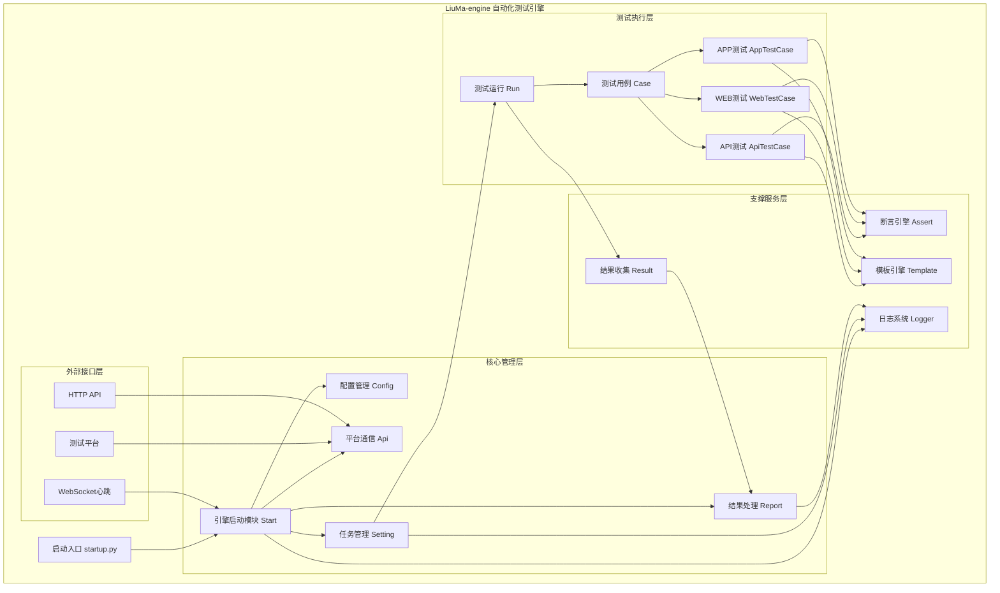

## 核心功能模块详细结构图

### 1. 引擎启动与管理模块

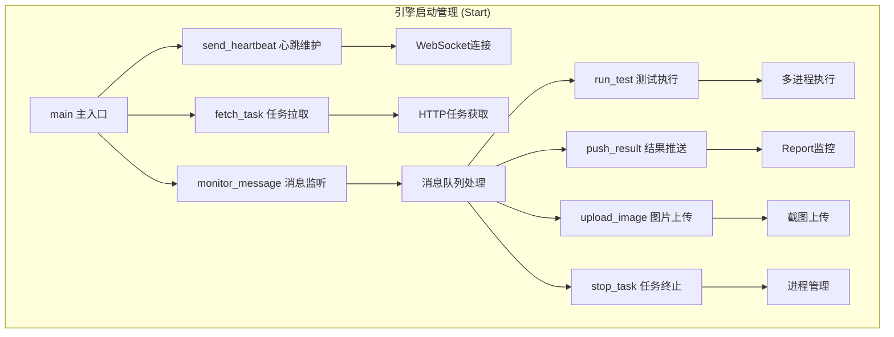

### 2. 配置管理模块

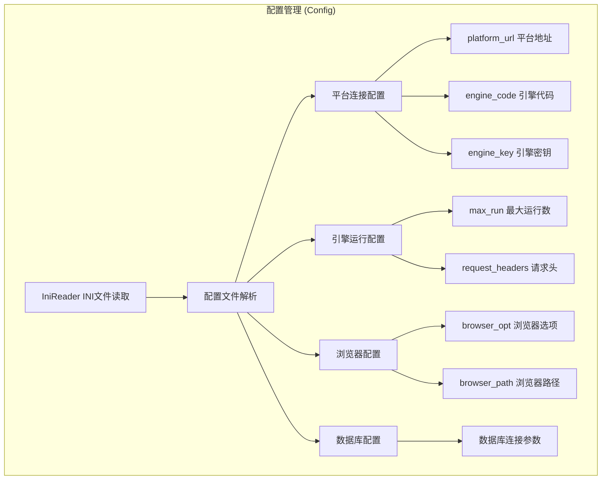

### 3. 平台通信模块

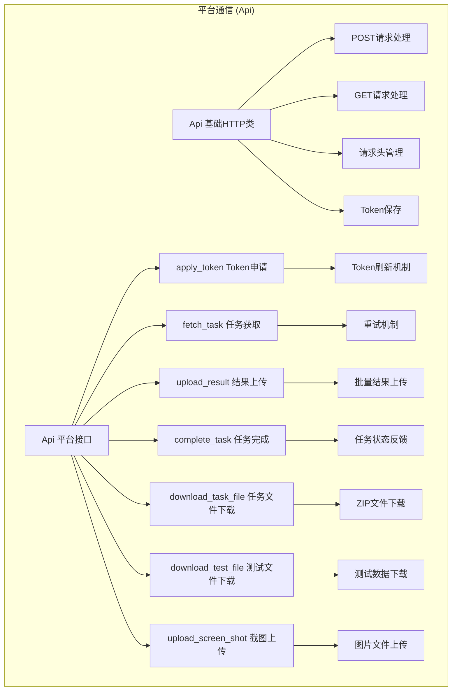

### 4. 任务管理与执行模块

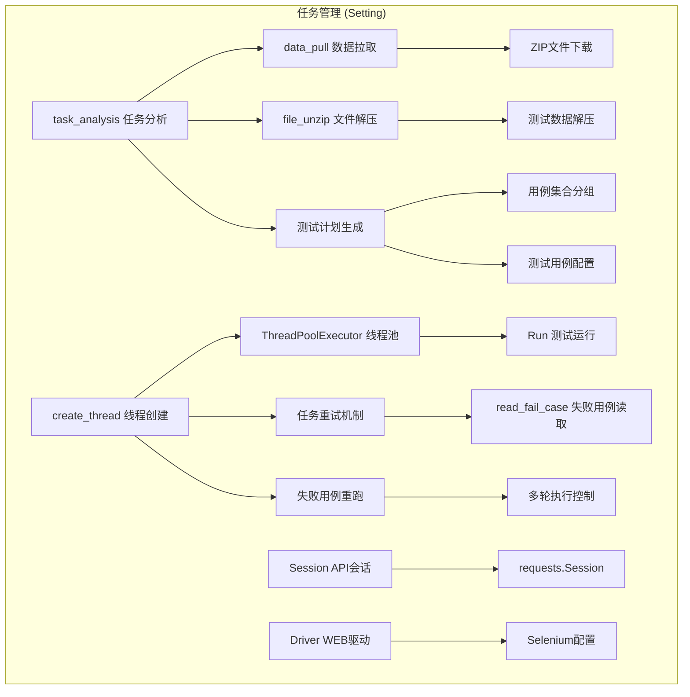

### 5. 测试执行核心模块

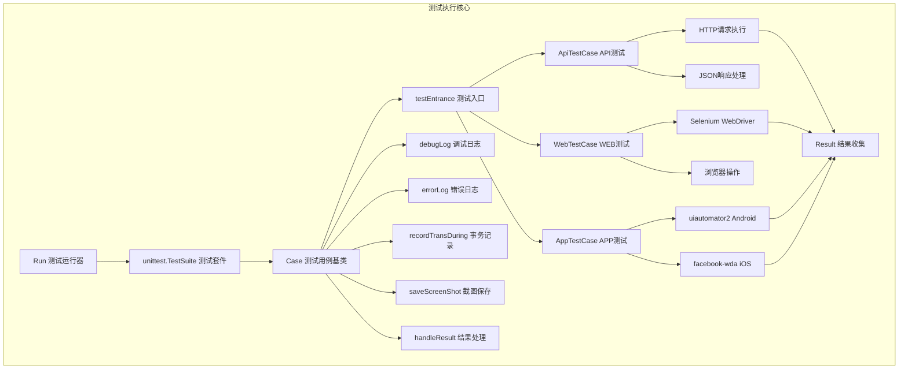

### 6. 断言引擎模块

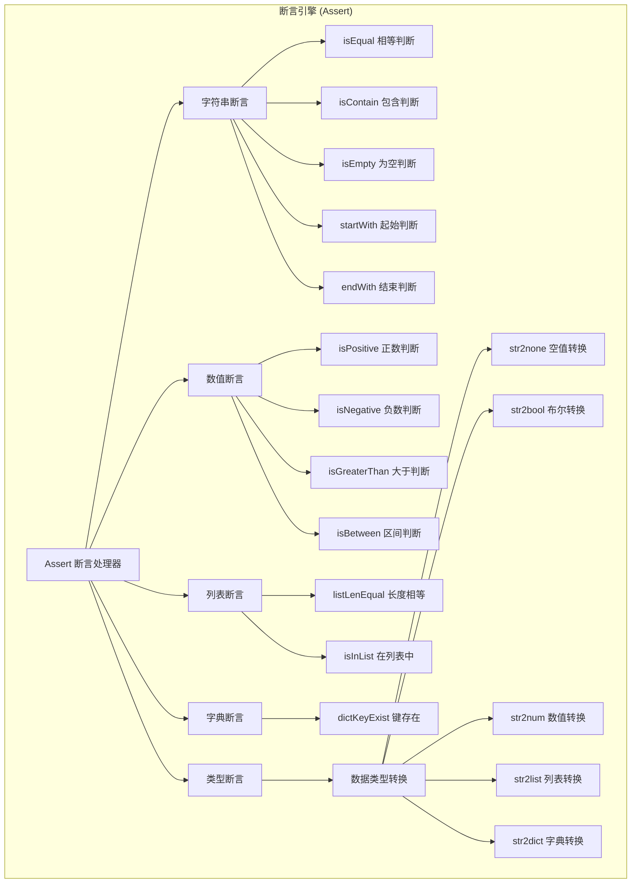

### 7. 模板引擎模块

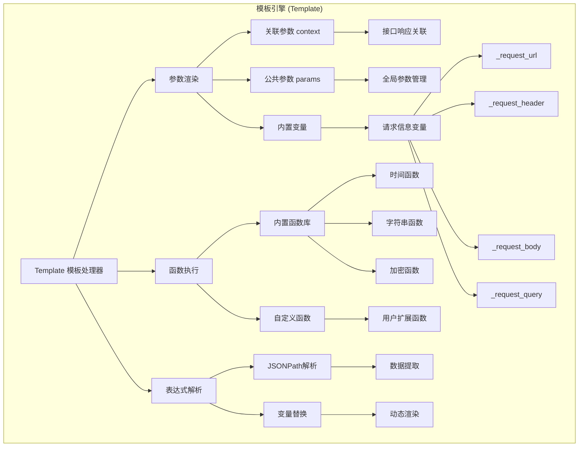

### 8. 测试用例执行器详细结构

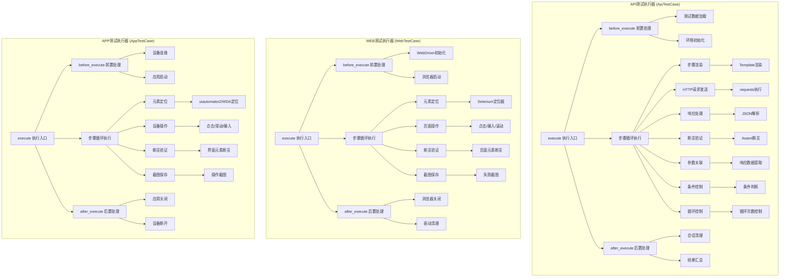

### 9. 日志与监控模块

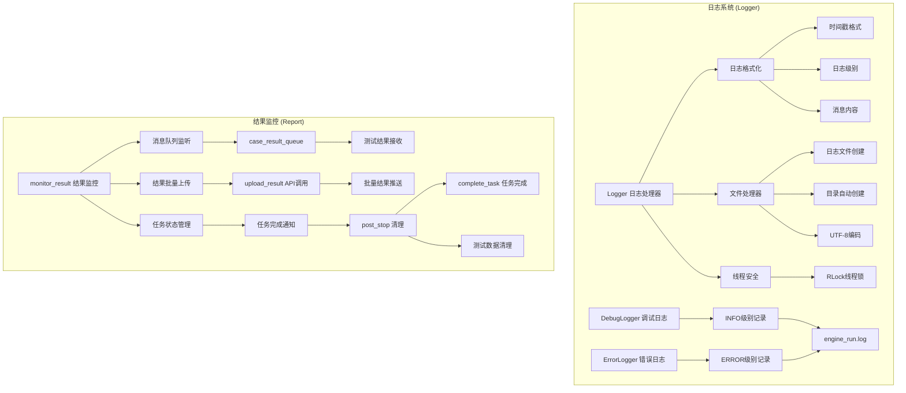

### 10. 数据流转图

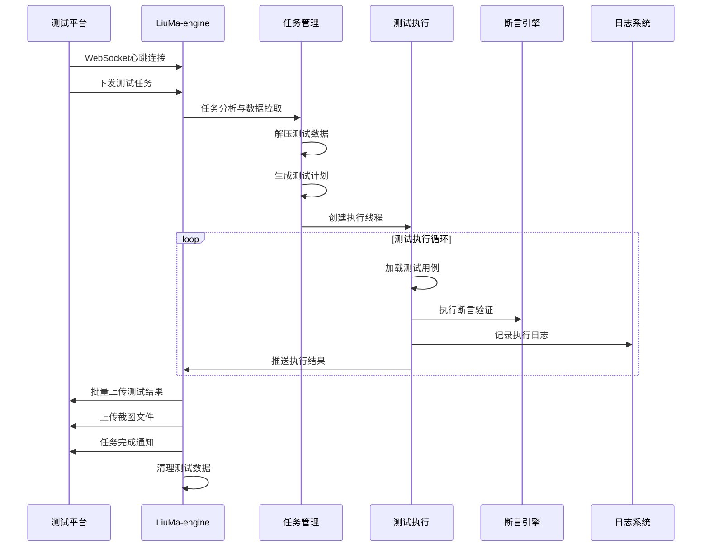

## 技术架构说明

### 核心技术栈

- **基础框架**: Python + unittest
- **API测试**: requests
- **WEB测试**: Selenium WebDriver
- **APP测试**: uiautomator2 (Android) + facebook-wda (iOS)
- **断言库**: assertpy
- **模板引擎**: 自研Template引擎
- **通信协议**: WebSocket + HTTP/HTTPS
- **并发处理**: ThreadPoolExecutor
- **配置管理**: INI格式配置文件

### 设计特点

1. **模块化设计**: 各功能模块职责清晰，低耦合高内聚
2. **多协议支持**: 支持API、WEB、APP三种测试类型
3. **智能断言**: 基于assertpy的智能断言引擎
4. **参数化测试**: 支持关联参数和公共参数管理
5. **模板渲染**: 强大的表达式和函数支持
6. **并发执行**: 基于线程池的高效并发执行
7. **实时监控**: WebSocket心跳和实时结果上报
8. **容错机制**: 完善的异常处理和重试机制

### 扩展能力

- **插件系统**: 支持自定义函数和断言扩展
- **数据驱动**: 支持多种数据源的数据驱动测试
- **流程控制**: 支持条件判断和循环控制
- **脚本扩展**: 支持Python和SQL脚本执行
- **平台集成**: 标准化的平台接口，易于集成

# 系统功能结构图创建完成

我已经成功为LiuMa-engine项目创建了详细的 系统功能结构图.md 文档，该文档包含以下核心内容：

### 📊 完成的图表内容

1. 系统整体架构图

- 展示了引擎的四层架构：核心管理层、测试执行层、支撑服务层、外部接口层
- 清晰描述了各模块间的依赖关系和数据流向

2. 核心功能模块详细结构图（10个子图）

- 引擎启动与管理模块 ：Start的完整工作流程
- 配置管理模块 ：Config的配置项分类和管理机制
- 平台通信模块 ：Api的接口功能和通信机制
- 任务管理与执行模块 ：Setting的任务分析和线程管理
- 测试执行核心模块 ：Run和Case的执行流程
- 断言引擎模块 ：Assert的断言类型和数据转换
- 模板引擎模块 ：Template的参数渲染和函数执行
- 测试用例执行器详细结构 ：API/WEB/APP三种测试类型的执行流程
- 日志与监控模块 ：Logger和Report的功能实现
- 数据流转图 ：完整的测试执行时序图

### 🔧 技术架构说明

核心技术栈 ：Python + unittest + requests + Selenium + uiautomator2/facebook-wda

设计特点 ：

- 模块化设计，职责清晰
- 多协议支持（API/WEB/APP）
- 智能断言引擎
- 参数化测试支持
- 强大的模板渲染能力
- 高效并发执行
- 实时监控机制
- 完善的容错机制

### 📁 文档特色

1. 层次清晰 ：从整体架构到具体模块，逐层深入
2. 逻辑严谨 ：准确反映了代码中各模块的实际关系
3. 内容详细 ：涵盖了所有核心功能和关键流程
4. 易于理解 ：使用Mermaid语法，图表直观清晰
5. 实用性强 ：既有宏观架构，又有微观实现细节
